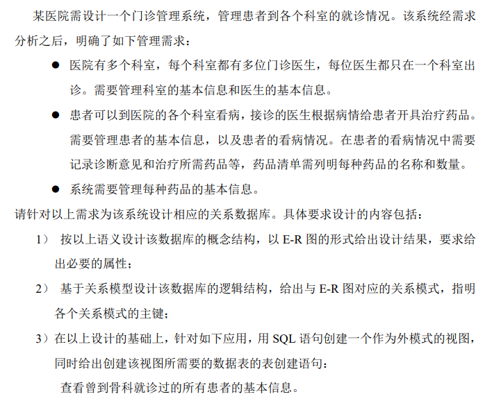

### 基本概念

- 从最初的数据处理到现在的数据库管理，数据管理技术经历了==人工管理、文件系统和数据库系统==三个阶段。
- 一个模式对应多个外模式，当模式结构改变，如增 加了 新的应用或应用需求改变而需要增加新的关系或关系中的属性时，则只要修改外模 式与模式间的对应关系，而不必修改外模式中的局部逻辑结构，因而相应的应用程序亦 可不必修 改，实现了数据的==逻辑独立性==。
- 数据库系统由计算机硬件、软件及==数据库的用户==组成。
- 在关系模型中，唯一的数据结构是==关系==。
- 在数据库设计中合并分 E-R 图时可能遇到的冲突主要有：==属性冲突、命名冲突、 和结构冲突==。
- 在关系代数运算中，==并、差、笛卡儿积、选择、投影==是基本的关系代数运算，其它的 运算可以由这些基本运算表示。
- 所谓聚集索引是指索引次序与表中元组的物理次序一致的索引。==显然，在一个基本表上仅能建立一个聚 集索引。==在经常需要查询的列上建立聚集索引对加快数据查询将起重要作用。
- 因此，在模式设计中，==不是规范化程度越高，所设计出的模式就越好==。一般最常用的是 3NF 和 BCNF。在设计中， 模式究竟分解为哪一级范式取决于实际应用。
- 数据依赖表示数据间存在的一种限制或制约关系。有多种数据依赖，常见的数据依 赖 有：==函数依赖、多值依赖、连接依赖==等。关系模式规范化是使得关系属性间的数据依 赖逐 渐趋向合理的过程。根据规范化程度的不同，关系模式可分为一范式~五范式。本章 将介 绍数据依赖的基本概念、公理、范式的概念及关系模式的规范化。
- 返回 table 数据类型的用户定义函数功能强大，==可以替代视图==。这些函数称为表值函数。
- 数据模型是数据库技术研究的一项主要内容。有两类数据模型，一类是独立于计算机之外的模型，称为==概念模型或信息模型==；一类是面向计算机的模型，通常称==数据模型==。数据模型的组成包括==数据结构、数据操作和数据完整性约束==三个方面。
- 无损连接的定义就是自然连接之后还能还原成原来的表
- 数据字典是在数据库设计的==需求分析==阶段建立的
- 一个事务在==申请封锁时以强锁代替弱锁是安全的==，反之则不然

1. 游标是用于在嵌入式SQL中处理结果集的机制。游标允许应用程序开发人员逐行处理结果集，并在需要时随时在结果集中移动。它可以用于在结果集中执行各种操作，如插入、更新和删除。游标通常用于处理大型结果集或需要在结果集中进行复杂操作的情况。
2. 数据库镜像是指将一个数据库的所有数据和对象复制到另一个数据库中，以实现数据的冗余备份和高可用性。在数据库镜像中，主数据库和镜像数据库之间保持同步，通过实时同步来确保数据的一致性。当主数据库发生故障或停机时，可以立即切换到镜像数据库上，从而实现快速恢复和高可用性。
3. 数据库逻辑结构设计的基本步骤如下：

- 将概念结构转化为特定DBMS支持的数据模型(关系、网状、层次模型)
- 对数据模型进行优化


### 设计题



请回答上面数据库问题，以markdown的格式给出答案结果和解析，如果涉及画E-R图的例子，请使用mermaid来画。

### GPT

## 答案

### 1. 概念结构设计

根据题目需求，可以设计如下 E-R 图：

```mermaid
erDiagram
	// 定义实体之间的关系
    医生 }|--|| 科室
    医生 ||--|{ 看病情况
    患者 ||--|{ 看病情况
    看病情况 ||--|| 用药清单
    用药清单 }|--|| 药品
    // 定义实体
    entity 科室 {
        科室编号
        科室名称
    }
    entity 医生 {
        医生编号
        医生姓名
        所属科室编号
    }
    entity 患者 {
        患者编号
        患者姓名
        患者性别
        患者年龄
        患者地址
        患者联系电话
    }
    entity 药品 {
        药品编号
        药品名称
        药品单价
    }
    entity 看病情况 {
        看病编号
        患者编号
        医生编号
        科室编号
        看病日期
        诊断意见
    }
    entity 用药清单 {
        看病编号
        药品编号
        药品数量
    }
```

根据 E-R 图中的实体和关系，可以得到以下实体属性和关系：

- 科室：科室编号（主键）、科室名称；
- 医生：医生编号（主键）、医生姓名、所属科室编号（外键）；
- 患者：患者编号（主键）、患者姓名、患者性别、患者年龄、患者地址、患者联系电话；
- 药品：药品编号（主键）、药品名称、药品单价；
- 看病情况：看病编号（主键）、患者编号（外键）、医生编号（外键）、科室编号（外键）、看病日期、诊断意见；
- 用药清单：看病编号（主键，外键）、药品编号（主键，外键）、药品数量。

### 2. 逻辑结构设计

根据概念结构设计，可以得到如下的关系模式：

- 科室（科室编号，科室名称）
- 医生（医生编号，医生姓名，所属科室编号）
- 患者（患者编号，患者姓名，患者性别，患者年龄，患者地址，患者联系电话）
- 药品（药品编号，药品名称，药品单价）
- 看病情况（看病编号，患者编号，医生编号，科室编号，看病日期，诊断意见）
- 用药清单（看病编号，药品编号，药品数量）

在上述关系模式中，每个关系模式的主键已经用粗体表示。

### 3. SQL语句和表创建语句

为了查看曾到骨科就诊过的所有患者的基本信息，我们需要创建一个视图来对数据进行查询。可以使用如下的 SQL 语句创建名为 `view_bone_patient` 的视图：

```sql
CREATE VIEW view_bone_patient AS
    SELECT *
    FROM 患者
    WHERE 患者编号 IN (
        SELECT DISTINCT 看病情况.患者编号
        FROM 看病情况
        WHERE 看病情况.科室编号 = 'bone'
    );
```

其中，`view_bone_patient` 为视图名称，`患者` 和 `看病情况` 分别是患者和看病情况的关系模式，`bone` 是骨科的科室编号。

为了创建这个视图，需要先创建上述关系模式对应的表。可以使用如下的 SQL 语句创建这些表：

```sql
-- 科室表
CREATE TABLE 科室 (
    科室编号 VARCHAR(10) PRIMARY KEY,
    科室名称 VARCHAR(50)
);

-- 医生表
CREATE TABLE 医生 (
    医生编号 VARCHAR(10) PRIMARY KEY,
    医生姓名 VARCHAR(20),
    所属科室编号 VARCHAR(10),
    FOREIGN KEY (所属科室编号) REFERENCES 科室(科室编号)
);

-- 患者表
CREATE TABLE 患者 (
    患者编号 VARCHAR(10) PRIMARY KEY,
    患者姓名 VARCHAR(20),
    患者性别 CHAR(1),
    患者年龄 INT,
    患者地址 VARCHAR(100),
    患者联系电话 VARCHAR(20)
);

-- 药品表
CREATE TABLE 药品 (
    药品编号 VARCHAR(10) PRIMARY KEY,
    药品名称 VARCHAR(50),
    药品单价 FLOAT
);

-- 看病情况表
CREATE TABLE 看病情况 (
    看病编号 VARCHAR(10) PRIMARY KEY,
    患者编号 VARCHAR(10),
    医生编号 VARCHAR(10),
    科室编号 VARCHAR(10),
    看病日期 DATE,
    诊断意见 VARCHAR(100),
    FOREIGN KEY (患者编号) REFERENCES 患者(患者编号),
    FOREIGN KEY (医生编号) REFERENCES 医生(医生编号),
    FOREIGN KEY (科室编号) REFERENCES 科室(科室编号)
);

-- 用药清单表
CREATE TABLE 用药清单 (
    看病编号 VARCHAR(10),
    药品编号 VARCHAR(10),
    药品数量 INT,
    PRIMARY KEY (看病编号, 药品编号),
    FOREIGN KEY (看病编号) REFERENCES 看病情况(看病编号),
    FOREIGN KEY (药品编号) REFERENCES 药品(药品编号)
);
```

这些表的设计和前面提到的关系模式是一致的。注意到在 `医生` 表、`看病情况` 表和 `用药清单` 表中都使用了外键来引用其他表的主键。

最后，可以使用 `SELECT` 语句来查询视图中的数据：

```sql
SELECT *
FROM view_bone_patient;
```

这条语句将返回所有曾到骨科就诊过的患者的基本信息。