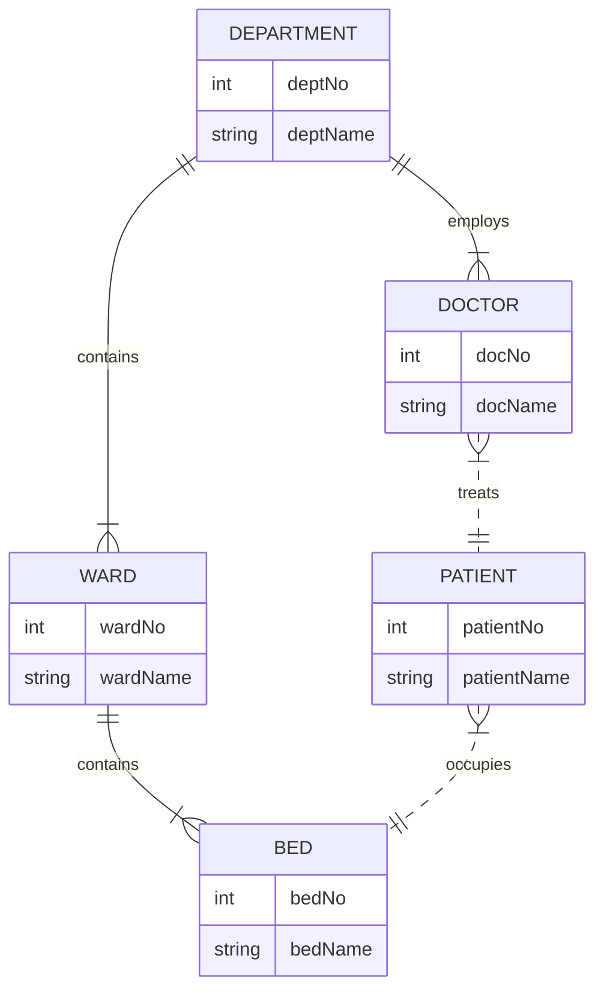

## 六、设计题（共20分）

某医院病房管理信息系统需要管理如下基本信息:一个科室有多个病房和多个医生，一个病房只能属于一个科室，一个医生也只属于一个科室，但可负责多个病人的诊治并给出相应的诊治意见;每个病房有多张病床，一个病人只能占用一张病床;由于轮流值班的原因，一个病人可能会在不同的时间由不同的医生负责诊治。
(1)请上述信息对此管理系统进行概念建模，用E-R图给出相应的概念模型。要求在E-R图中注明属性和联系的类型。(6分)
(2)将所得的E-R模型转换成关系模型。(5分)
(3)确定各个关系模式的函数依赖集，并指出各关系模式的主键。(5分)
(4)判断各关系模式最高可达到第几范式?如果某个关系模式不是3NF，请给出关系可能的3NF分解。(4分)

## prompt

请回答上面数据库问题，以markdown的格式给出答案结果和解析，如果涉及画E-R图的例子，请使用mermaid来画。

## GPT生成的答案

1. 概念建模 E-R 图如下：

解析：
- 科室（Department）和病房（Ward）之间是一对多的拥有关系，一个病房只能属于一个科室，一个科室可以有多个病房。
- 科室（Department）和医生（Doctor）之间也是一对多的拥有关系，一个医生只能属于一个科室，一个科室可以有多个医生。
- 医生（Doctor）和病人（Patient）之间是多对多的诊治关系，一个医生可以负责多个病人的诊治，一个病人也可以被多个医生负责诊治。
- 病房（Ward）和病床（Bed）之间是一对多的拥有关系，一个病房可以有多张病床，一张病床只能属于一个病人。

2. 关系模型如下：

Department(<u>DeptID</u>， DeptName)

Ward(<u>WardID</u>， WardName， DeptID)

Doctor(<u>DoctorID</u>， DoctorName， DeptID)

Patient(<u>PatientID</u>， PatientName， BedID)

Bed(<u>BedID</u>， WardID)

Diagnosis(<u>DoctorID， PatientID， DiagnosisTime</u>， DiagnosisResult)

解析：
- Department表存储科室信息，其中DeptID为主键。
- Ward表存储病房信息，其中WardID为主键，DeptID为外键，关联Department表。
- Doctor表存储医生信息，其中DoctorID为主键，DeptID为外键，关联Department表。
- Bed表存储病床信息，其中BedID为主键，WardID为外键，关联Ward表。
- Patient表存储病人信息，其中PatientID为主键，BedID为外键，关联Bed表。
- Diagnosis表存储诊治信息，其中DoctorID和PatientID构成联合主键，DiagnosisTime为诊治时间。

3. 关系模式的函数依赖集和主键如下：

- Department(<u>DeptID</u>， DeptName)
  - 主键：DeptID
  - 没有非主属性，因此没有函数依赖。

- Ward(<u>WardID</u>， WardName， DeptID)
  - 主键：WardID
  - 函数依赖：WardID → WardName，WardID → DeptID

- Doctor(<u>DoctorID</u>， DoctorName， DeptID)
  - 主键：DoctorID
  - 函数依赖：DoctorID → DoctorName，DoctorID → DeptID

- Patient(<u>PatientID</u>， PatientName， BedID)
  - 主键：PatientID
  - 函数依赖：PatientID → PatientName，PatientID → BedID

- Bed(<u>BedID</u>， WardID)
  - 主键：BedID
  - 函数依赖：BedID → WardID

- Diagnosis(<u>DoctorID， PatientID， DiagnosisTime</u>， DiagnosisResult)
  - 主键：DoctorID， PatientID， DiagnosisTime
  - 函数依赖：DoctorID， PatientID → DiagnosisTime，DoctorID， PatientID， DiagnosisTime → DiagnosisResult

4. 所有关系模式都已经达到了第三范式（3NF），因为每个非主属性都依赖于候选键的全部而不是部分。因此，不需要进行分解。

## Claude

## 答案 
### 1. E-R模型  
使用mermaid画出E-R图:

### 2. 关系模型
- DEPARTMENT(deptNo, deptName) 科室关系
- DOCTOR(docNo, docName, deptNo) 医生关系  
- WARD(wardNo, wardName, deptNo) 病房关系
- BED(bedNo, bedName, wardNo) 病床关系
- PATIENT(patientNo, patientName, deptNo, docNo, bedNo) 病人关系  

### 3. 函数依赖集和主键  
- DEPARTMENT(deptNo → deptName,deptNo) 主键:deptNo  
- DOCTOR(docNo → docName, deptNo, docNo) 主键:docNo
- WARD(wardNo → wardName, deptNo, wardNo) 主键:wardNo
- BED(bedNo → bedName, wardNo, bedNo) 主键:bedNo
- PATIENT(patientNo → patientName, deptNo, docNo, bedNo, patientNo) 主键:patientNo  

### 4. 范式判断和分解
- DEPARTMENT:2NF  
- DOCTOR:2NF  
- WARD:2NF
- BED:2NF  
- PATIENT:第3范式,无需分解