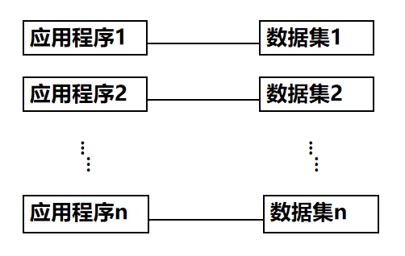

# 一、数据库系统引论

## 数据库系统概述

[TOC]

四个基本概念

- 数据（Data)
- 数据库（Database)
- 数据库管理系统（DBMS)
- 数据库系统（DBS)

### 数据（Data)

- 数据（Data）是数据库中存储的==基本对象==

- 数据的定义
  - 描述事物的==符号记录==
- 数据的种类
  - 数字、文字、图形、图像、音频、视频、学生的档案记录等

### 数据库（Database)

- 数据库的定义
  数据库（Database，简称DB）是==长期储存==在计算机内、==有组织==的、==可共享==的大量数据的集合。
- 数据库的基本特征
  - 数据按一定的数据模型组织、描述和储存
  - 可为各种用户共享
  - 冗余度较小
  - 数据独立性较高
  - 易扩展

### 数据库管理系统（DBMS)

- 什么是数据库管理系统
  - 位于用户与操作系统之间的一层数据管理软件
  - 是基础软件，是一个大型复杂的软件系统 
- 数据库管理系统的用途
  - 科学地组织和存储数据、高效地获取和维护数据

#### 主要功能

- 数据==定义==功能
  - 提供数据定义语言（DDL）
  - 定义数据库中的数据对象
- 数据==组织、存储和管理==
  - 分类组织、存储和管理各种数据
  - 确定组织数据的文件结构和存取方式
  - 实现数据之间的联系
  - 提供多种存取方法提高存取效率

- 数据==操纵==功能
  - 提供数据操纵语言（DML）
  - 实现对数据库的基本操作  （查询、插入、删除和修改）
- 数据库的==事务管理==和==运行管理==
  - 数据库在建立、运行和维护时由数据库管理系统统一管理和控制
  - 保证数据的安全性、完整性、多用户对数据的并发使用
  - 发生故障后的系统恢复

- 数据库的==建立==和==维护==功能
  - 数据库初始数据的装载和转换
  - 数据库转储、恢复功能
  - 数据库的重组织
  - 性能监视、分析等
- 其它功能
  - 数据库管理系统与网络中其它软件系统的通信
  - 数据库管理系统系统之间的数据转换
  - 异构数据库之间的互访和互操作

### 数据库系统（DBS)

- 数据库系统（Database System，简称DBS）
- 数据库系统的构成
  - 数据库
  - 数据库管理系统（及其应用开发工具）
  - 应用程序
  - ==数据库管理员==

#### 数据管理技术的产生和发展

- 什么是数据管理

  - 对数据进行分类、组织、编码、存储、检索和维护
  - 数据处理的中心问题
- 数据管理技术的发展过程

  - 人工管理阶段（20世纪50年代中之前）
  - 文件系统阶段（20世纪50年代末--60年代中）
  - 数据库系统阶段（20世纪60年代末--现在）

| 应用程序与数据的对应关系（人工）                             | 应用程序与数据的对应关系（文件）                             | 应用程序与数据的对应关系（DBS）                              |
| ------------------------------------------------------------ | ------------------------------------------------------------ | ------------------------------------------------------------ |
|  |  |  |

### 数据库系统的特点

#### 数据结构化

- ==数据的整体结构化==是数据库的主要特征之一    
- 整体结构化
  - 不再仅仅针对某一个应用，而是面向全组织
  - 不仅数据内部结构化，整体是结构化的，数据之间具有联系
  - 数据记录可以==变长==
  - 数据的最小存取单位是==数据项==
- 数据的用==数据模型==描述，无需应用程序定义

#### 数据的共享性高，冗余度低且易扩充

- 数据面向整个系统，可以被多个用户、多个应用共享使用。
- 数据共享的好处
  - 减少数据冗余，节约存储空间
  - 避免数据之间的不相容性与不一致性 
  - 使系统易于扩充

#### 数据独立性高

- 物理独立性
  - 指用户的应用程序与数据库中数据的物理存储是相互独立的。当数据的物理存储改变了，应用程序不用改变
- 逻辑独立性
  - 指用户的应用程序与数据库的逻辑结构是相互独立的。数据的逻辑结构改变了，应用程序不用改变
- 数据独立性由数据库管理系统的==二级映像==功能来保证。

#### 数据由数据库管理系统统一管理和控制

- 数据库管理系统提供的数据控制功能
  - 数据的安全性（Security）保护
    - 保护数据以防止不合法的使用造成的数据的泄密和破坏
  - 数据的完整性（Integrity）检查
    - 保证数据的正确性、有效性和相容性
  - 并发（Concurrency）控制
    - 对多用户的并发操作加以控制和协调，防止相互干扰而得到错误的结果
  - 数据库恢复（Recovery）
    - 将数据库从错误状态恢复到某一已知的正确状态

### 小结

- 数据库是长期存储在计算机内有组织的大量的==共享的数据集合==
- 可以供各种用户共享，具有==最小冗余度==和==较高的数据独立性==
- ==数据库管理系统==在数据库建立、运用和维护时对数据库进行统一控制，以保证数据的完整性、安全性，并在多用户同时使用数据库时进行并发控制，在发生故障后对数据库进行恢复

## 数据模型

- 模型方法是一种==抽象==表示
- ==数据模型==就是信息领域中采用的模型方法

- 数据模型是数据特征的抽象，用来描述数据的一组概念和定义。包含 ：
  - ==数据结构== 
    - 对数据静态特性的描述
    - 应用所涉及的对象和对象具有的特征，对象间的联系 
  - ==数据操作==
    - 对数据的动态特性的描述
    - 对数据库中对象实例执行的一组操作，检索、插入、删除、修改等  
  - ==数据的完整性约束==
    - 对数据静态和动态特性的限定 
    - 反映了数据间的制约和依存关系 

## 数据库系统的结构

#### 数据库系统的结构

- 从==数据库应用开发人员角度==看，数据库系统通常采用三级模式结构，是数据库系统内部的系统结构 
- 从数据库==最终用户角度==看，数据库系统的结构分为:
  - 单用户结构
  - 主从式结构
  - 分布式结构
  - 客户-服务器
  - 浏览器-应用服务器／数据库服务器多层结构等

#### 数据库系统模式的概念

- ==型（Type）==
  - 对某一类数据的结构和属性的说明
- ==值（Value）==
  - 是型的一个具体赋值
- 例子
  - 学生记录（学号，姓名，性别，系别，年龄，籍贯）
  - 一个记录值（201315130，李明，男，计算机系，19，江苏南京市）

- ==模式（Schema）==
  - 数据库==逻辑结构==和==特征==的描述
  - 是==型==的描述，不涉及具体值
  - 反映的是数据的结构及其联系
  - 模式是相对稳定的
- ==实例（Instance）==
  - 模式的一个具体值
  - 反映数据库某一时刻的状态
  - 同一个模式可以有很多实例
  - 实例随数据库中的数据的更新而变动

### 数据库系统的三级模式结构

#### 模式（Schema）

- 模式（也称逻辑模式）
  - 数据库中==全体数据==的逻辑结构和特征的描述
  - 所有用户的==公共数据视图==
- 一个数据库只有一个模式
- 模式的地位：是数据库系统模式结构的==中间层==
  - 与数据的物理存储细节和硬件环境无关
  - 与具体的应用程序、开发工具及高级程序设计语言无关
- 模式的定义
  - 数据的逻辑结构（数据项的名字、类型、取值范围等）
  - 数据之间的联系
  - 数据有关的安全性、完整性要求

#### 外模式（External Schema）

- 外模式（也称子模式或用户模式）
  - 数据库用户（包括应用程序员和最终用户）使用的==局部数据==的逻辑结构和特征的描述
  - 数据库用户的==数据视图==，是与某一应用有关的数据的逻辑表示

- 外模式的地位：介于模式与应用之间
  - 模式与外模式的关系：==一对多==
  - 外模式与应用的关系：==一对多==
- 外模式的用途
  - 保证数据库安全性的一个有力措施
  - 每个用户只能看见和访问所对应的外模式中的数据

#### 内模式（Internal Schema）

- 内模式（也称存储模式）
  - 是数据==物理结构==和==存储方式==的描述
  - 是数据在数据库内部的表示方式
    - 记录的存储方式（例如，顺序存储，按照B树结构存，按hash方法存等）
  - 索引的组织方式
  - 数据是否压缩存储
  - 数据是否加密
  - 数据存储记录结构的规定

- 一个数据库只有一个内模式

#### 数据库的二级映像功能与数据独立性

- 三级模式是对数据的三个抽象级别
- 二级映象在数据库管理系统内部实现这三个抽象层次的==联系==和==转换==
  - 外模式／模式映像
  - 模式／内模式映像 

##### 外模式／模式映像

- 模式：描述的是数据的全局==逻辑结构==
- 外模式：描述的是数据的局部==逻辑结构== 
- 同一个模式可以有任意==多个==外模式 
- 每一个外模式，数据库系统都有一个外模式／模式映象，定义外模式与模式之间的对应关系
- 映象定义通常包含在各自外模式的描述中

- 保证数据的==逻辑独立性==
  - 当模式改变时，数据库管理员对外模式／模式映象作相应改变，使外模式保持不变
  - 应用程序是依据数据的外模式编写的，应用程序不必修改，保证了数据与程序的逻辑独立性，简称数据的==逻辑独立性==

##### 模式／内模式映像

- 模式／内模式映象定义了数据全局==逻辑结构与存储结构==之间的对应关系
  - 例如，说明逻辑记录和字段在内部是如何表示的
- 数据库中模式／内模式映象是==唯一==的
- 该映象定义通常包含在模式描述中

- 保证数据的==物理独立性==
  - 当数据库的存储结构改变了（例如选用了另一种存储结构），数据库管理员修改模式／内模式映象，使模式保持不变。
  - 应用程序不受影响。保证了数据与程序的物理独立性，简称数据的==物理独立性==。

### 小结

- 数据库模式
  - 即全局逻辑结构是数据库的==中心与关键== 
  - 独立于数据库的其他层次 
  - 设计数据库模式结构时应==首先==确定数据库的==逻辑模式==
- 数据库的内模式
  - 依赖于它的全局逻辑结构
  - ==独立==于数据库的用户视图，即外模式
  - ==独立==于具体的存储设备  
  - 将全局逻辑结构中所定义的数据结构及其联系按照一定的物理存储策略进行组织，以达到较好的时间与空间效率 

- 数据库的外模式
  - 面向具体的应用程序
  - 定义在逻辑模式之上
  - ==独立==于存储模式和存储设备
  - 当应用需求发生较大变化，相应外模式不能满足其视图要求时，该外模式就得做相应改动 
  - 设计外模式时应充分考虑到应用的==扩充性== 
- 特定的应用程序
  - 在外模式描述的数据结构上编制的
  - 依赖于特定的==外模式==
  - 与数据库的模式和存储结构==独立==
  - 不同的应用程序有时可以共用同一个外模式

- 数据库的二级映像
  - 保证了数据库外模式的==稳定性==
  - 从底层保证了应用程序的稳定性，除非应用需求本身发生变化，否则应用程序一般不需要修改
- ==数据与程序之间的独立性==，使得数据的定义和描述可以从应用程序中分离出去 

> 这一点和在java还是android编程还是最初始的面向对象中都有体现，数据和程序之间是分开的，直接反应这一点的也可以去查看一下嵩天老师的python课程，画turtle的时候就将数据和程序分开了——回想起了久远的记忆

- 数据的存取由数据库管理系统管理
  - 简化了应用程序的编制
  - 大大减少了应用程序的维护和修改 

## 数据库系统的组成

- 数据库
- 数据库管理系统（及其开发工具）
- 应用程序
- 数据库管理员

### 硬件平台及数据库

- 数据库系统对硬件资源的要求
  - 足够大的内存
  - 足够的大的磁盘或磁盘阵列等设备
  - 较高的通道能力，提高数据传送率

### 软件

- 数据库管理系统
- 支持数据库管理系统运行的操作系统
- 与数据库接口的高级语言及其编译系统
- 以数据库管理系统为核心的应用开发工具
- 为特定应用环境开发的数据库应用系统

### 人员

- 数据库管理员
- 系统分析员和数据库设计人员
- 应用程序员
- 最终用户

| 数据库管理员（DBA）                                          | 系统分析员和数据库设计人员                                   |
| ------------------------------------------------------------ | ------------------------------------------------------------ |
|  |  |
| **应用程序员**                                               | **应用程序员与用户**                                         |
|  |  |

## 小结

- 数据库系统概述
  - 数据库的基本概念
  - 数据管理的发展过程
  - 数据库系统的特点
- 数据模型
  - 数据模型的三要素
  - 三种主要数据库模型
- 数据库系统内部的系统结构
  - 数据库系统三级模式结构
  - 数据库系统两层映像系统结构
- 数据库系统的组成