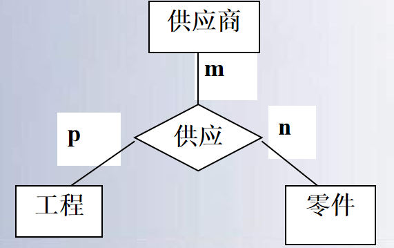

# 二、数据模型

数据模型是现实世界数据特征的抽象根据模型应用的不同目的，数据模型分为两类

[TOC]

## 数据模型

### 概念模型   

- 也称信息模型，它是按用户的观点来对数据和信息建模。主要用于数据库设计

### 数据模型

- ==逻辑数据模型==主要包括网状模型、层次模型、关系模型、面向对象模型、对象关系模型等
  - 网状模型是按计算机系统的观点对数据建模，主要用于DBMS的实现
- 物理数据模型是对数据最低层次的抽象，它描述数据在系统内部的表示方式和存取方法，在磁盘或磁带上的存储方式和存取方法。
  - 物理模型的实现是DBMS的任务，数据库设计人员要了解和选择物理模型

## 数据模型三要素

数据模型通常由==数据结构==、==数据操作==和==完整性约束==三个要素组成。 

1. 数据结构
   - 描述系统==静态特性==
2. 数据操作
   - 数据操作用于描述系统的==动态特性==
3. 数据的完整性约束条件
   - 数据模型应提供定义完整性约束条件的机制

## E-R概念模型

- 概念模型的用途
  - 用于信息世界的建模
  - 是现实世界到机器世界的一个中间层次
  - 是数据库设计的有力工具
  - 数据库设计人员和用户之间进行交流的语言
- 对概念模型的基本要求
  - 较强的语义表达能力，能够方便、直接地表达应用中的各种语义知识
  - 简单、清晰、易于用户理解。

### 基本概念

1. ==实体（Entity）==
   - ==客观存在并可相互区别的事物==称为实体。
   - 可以是具体的对象，如一个学生,一本书,一辆汽车；也可以是抽象的概念或联系，如一堂课,一次比赛等
2. ==属性（Attribute）==
   - ==实体所具有的某一特征==称为属性。
   - 一个实体可以由若干个属性来刻画，如学生实体有学号、姓名、年龄、性别、系等方面的属性
   - 属性有“类型”和“值”之分，
     - “类型”即为属性名，如姓名、年龄、性别是属性的型；“值”即为属性的具体内容，
     - 如(990001，张立，20，男，计算机)这些属性值的集合表示了一个学生实体。
3. ==联系（Relationship）==
   - 在现实世界中，事物内部以及事物之间是有联系的
   - 在信息世界中将被抽象为实体内部的联系和实体之间的联系。
     - ==实体内部的联系==通常是指组成实体的各属性之间的联系；
     - ==实体之间的联系==通常是指不同实体集之间的联系

|                           1:1联系                            |                           1:n联系                            |                           m:n联系                            |
| :----------------------------------------------------------: | :----------------------------------------------------------: | :----------------------------------------------------------: |
|  |  |  |

### 两个以上的实体集之间的联系

- 多个实体集之间也可以存在有联系，称多元联系 
  - 若规定：
    - 一个供应商可供应多种零件给多个工程，
    - 一个工程可由多个供应商供应多种零件，
    - 一种零件可由多个供应商供应给多个工程，

|     供应商、零件和工程间存在着多对多的联系, 表示为m:n:p      |                 三个实体两两之间的多对多联系                 |
| :----------------------------------------------------------: | :----------------------------------------------------------: |
|  |  |
| 该图表示的是三个实体间的供应关系:
某个供应商供应某种零件给某个工程 
“供应商S1供应零件P2给工程J1” | 三个实体两两之间的多对多仅能表示:
一个工程需要哪些零件,
这些零件可以由哪些供应商供应，
无法表示👇:
一个工程所用的零件具体由哪个供应商供应
一个供应商具体供应哪种零件给哪个工程 |

### 实体集内部不同实体间的联系

- 同一实体集内一对多联系
  - 实例
    -  职工实体集内部具有领导与被领导的联系
    - 某一职工（干部）“领导”若干名职工
    - 一个职工仅被另外一个职工直接领导
    - 这是一对多的联系
- 同一实体集内一对一联系
- 同一实体集内多对多联系

|                   同一实体型内部的1:n联系                    |
| :----------------------------------------------------------: |
|  |

## E-R数据模型

- 概念模型的表示方法很多，最著名的是E-R模型

- 实体 - 联系方法(Entity-Relationship Approach)
- 用E-R图来描述现实世界的概念模型, E-R方法也称为E-R模型
- E-R图三个基本成分：实体、属性和联系的方法

|                             实体                             |                             属性                             |                             联系                             |
| :----------------------------------------------------------: | :----------------------------------------------------------: | :----------------------------------------------------------: |
|  |  |               |
|            实体: 用矩形表示，矩形框内写明实体名。            |    属性: 用椭圆形表示，并用无向边将其与相应的实体连接起来    | 联系： 实体之间的联系用菱形框表示，菱形框内标明联系名，并分别用连线将关联的实体连接起来，在连线旁标明实体间联系的类型 ； 选课联系用属性成绩来表示某个学生选修某门课的成绩，属性成绩不能放在学生或课程实体中，该属性是描述选课联系的。 |

- E-R模型中实体间的联系提供了较多的语义
- 基数比约束
  - 如在二元联系中有1:1，1:n，m:n的联系 
- 参与约束 
  - 根据实体集中的实体是否全部参与联系来描述实体参与联系的约束 
  - 一个实体集中的所有实体都参与联系称为==完全参与==，否则，称为==部分参与==。
  - 如在教师与课程联系中，一门课至少要有一位教师讲授；而有教师不担任授课任务，则在这一联系中，课程实体为完全参与，教师实体为部分参与

- 实体的参与度
  - ==实体参与联系的最小和最大次数，称实体的参与度==
  - 例如，学生选课中，
    - 如果规定一个学生最少选修2门课，最多选修5门课，则学生在选课联系中的参与度是(2，5)
    - 规定一门课至少要有10个学生选修，至多有60个学生选修，则课程在选课联系中的参与度是(10,60) 

## 关系模型

关系模型是最重要的一种数据模型。系统而严格地提出关系模型的是美国IBM公司的E.F.Codd

- 1970年提出关系数据模型   
- E.F.Codd, “A Relational Model of Data for Large Shared Data Banks”, 《Communication of the ACM》,1970
- 之后，提出了关系代数和关系演算的概念
- 1972年提出了关系的第一、第二、第三范式
- 1974年提出了关系的BC范式
- 从而开创了数据库的关系方法和数据规范化理论的研究，他为此获得了1981年的图灵奖。

### 基本概念和结构

在关系模型中，基本数据结构被限制为二维表，一张二维表称为一个关系 
1. 关系
  - 关系是数学上集合论中的一个概念，关系模型是以关系为基础发展起来的 

(1) 关系（relation） 

- 关系是一张二维表，是由多个行和列组成的。一个关系可用来描述一个实体集 

| **学 号**   | **姓 名** | **出生年月** | **性 别** | **入学年份** | **班 级**  |
| ----------- | --------- | ------------ | --------- | ------------ | ---------- |
| **2006901** | **张 伟** | **1988.01**  | **男**    | **2006**     | **200602** |
| **2007912** | **王 刚** | **1989.03**  | **男**    | **2007**     | **200705** |
| **...**     | **...**   | **...**      | **...**   | **...**      | **...**    |

(2) 属性（attribute）

- 一个关系有多个列，每一列为关系的一个属性 
  - 如学生关系中，有属性名学号、姓名、出生年月 

(3) 域（domain）	

- 一个属性对应一个值的集合。域是属性的取值范围
  - 如学号的域是7位字符数字的集合，学生姓名是汉字字符串的集合等 

(4) 元组（tuple） 

- 关系是元组的集合，一个元组对应实体集中的一个个体。
- 一个元组由若干个分量组成。一个分量对应一个属性值。

(5) 键（key）

- 键是一个或多个属性组成的能够唯一标识一个元组

### 概念模式与逻辑模式的对应

|          | ER模型                                                       | 关系数据模型                                                 |
| :------: | :----------------------------------------------------------- | ------------------------------------------------------------ |
| 数据结构 | 实体集 实体集属性 联系集与属性 实体的实例 主键/候选键 | 关系表 表的列 表和列 表中的各行 表的主键/候选键 |
| 数据操作 | /                                                            | SQL语句
关系代数、关系演算                                    |
|   约束   | 联系类型约束 键约束 完全参与约束                   | 实体完整性、
参照完整性、
用户自定义完整性                     |

