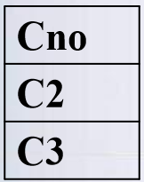
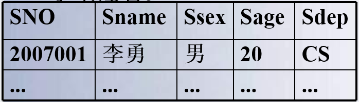

# 三、关系数据库

[TOC]

## 关系的定义

在关系理论是以集合代数理论为基础的，因此，我们可以用集合代数给出二维表的“关系”定义。先引入==域==和==笛卡尔积==的概念。 

### 域(Domain)

- 域是一组具有==相同数据类型==的值的集合
  - 自然数、整数、{男、女}、{0、1}
- 关系中用域表示属性的取值范围，例如
  - D1={李丽，王平，刘伟}
  - D2={男，女}
  - D3={47，28，30}
  - 其中D1，D2，D3为域名， 分别表示教师关系中姓名、性别、年龄的集合

### 笛卡尔积(Cartesian Product)

#### 笛卡尔积(Cartesian Product)

- 定义3.1 给定一组集合D1，D2，…，Dn，它们可以是相同的。 D1， D2， …， Dn的笛卡尔积为：

$$
D_1×D_2×…×D_n=\{(d_1,d_2,…,d_n) | d_i \in D_i, i=1,2,…,n\}
$$

- 所有域的所有值的一个组合，不能重复

#### 元组(Tuple)

- 笛卡尔积中每一个元素(d1，d2，…，dn)叫做一个n元组(n-tuple)或简称元组
- 例(张清玫，计算机专业，李勇)、 (张清玫，计算机专业，刘晨)是元组

#### 分量(Component)

- 笛卡尔积元素(d1，d2，…，dn)中的每一个值di叫做一个分量
- 例张清玫，计算机专业，李勇，刘晨是分量

### 关系

- 关系
  - 定义3.2 D1×D2×…×Dn的任一个子集称为D1， D2， …， Dn上的一个关系。n叫做关系的目或度(degree)

- 元组和属性

  - 关系中的每一行对应一个元组， 通常用t表示

  - 每一列对应一个域。关系中的列称为属性，每一列用属性名表示 。$t[A_i]$表示元组t在属性Ai上的值 

- 一元关系与二元关系

  - 当n=1时，称该关系为一元关系（Unary relation）

  - 当n=2时，称该关系为二元关系（Binary relation）

  - 按照定义，关系可以是一个无限集合

  - 由于笛卡尔积不满足交换律，所以

$$
(d_1,\ldots d_i,d_j,\ldots d_n)\neq(d_1,\ldots d_j,d_i,\ldots d_n)
$$

- 严格地说，==关系==是一种规范化了的==二维表==中行的集合，
- 当关系作为关系代数数据模型的数据结构时，需要作出补充和限定。
  - 无限关系在数据库中是无意义的，因此限定关系代数数据模型中的关系必须是有限集合。
  - 通过为关系的每列==增加一个属性名==的方法取消元组的有序性，即

$$
(d_1,\ldots d_i,d_j,\ldots d_n)=(d_1,\ldots d_j,d_i,\ldots d_n)\\i,j=1,2,\ldots,n
$$

## 关系模式和关系数据库

- 关系模式(Relation Schema)是对关系的描述，
  - 该描述包括关系名、属性名、属性的类型和长度，以及属性间固有的数据关联关系
  - 关系模式一般简记为关系名和属性名的集合
    - $R(A_1,A_2,\ldots,A_n)$，或仅用关系名R表示。
  - 如图书关系模式可描述为：
    - 图书(书号，书名，作者，单价，出版社)
- 关系的值是元组的集合，称为关系 
  - 关系是对现实世界中事物在某一时刻状态的反映，关系的值是随时间在不断变化的 
- ==关系模式和关系统称为关系==，通过上下文加以区别

## 键

- 为了区分不同元组，用其中一个或多个属性值标识，能够唯一标识元组的属性或属性组称为关系的键 
- 关系中能够起标识作用的键称为==候选键==
  - 在一个关系中，如果有多个候选键，选其中的一个键作为==主键(primary key)== 
  - 若关系的键由多个属性组成，称为联合键 
  - 关系的所有属性构成该关系的键，称为全键
-  键（key）
  - 键是一个或多个属性组成的，能够唯一标识一个元组。 

|                   主键、候选键、超键的关系                   |                           具体例子                           |
| :----------------------------------------------------------: | :----------------------------------------------------------: |
|  |  |

ref:link:[关系模型中的键类型（候选键、超级键、主键、备用键和外来键） - GeeksforGeeks](https://www.geeksforgeeks.org/types-of-keys-in-relational-model-candidate-super-primary-alternate-and-foreign/)

## 完整性约束

- 关系模型的完整性规则是对关系的某种约束条件

- 为了维护数据库中数据与现实世界的一致性，对关系数据库的插入、删除和修改操作必须有一定的约束条件，这就是关系模型的三类完整性：

  - 实体完整性
    - 通常由关系系统自动支持
  - 参照完整性
    - 通常由关系系统自动支持

  > 实体完整性和参照完整性是关系的两个不变性，应该由关系系统自动支持

  - 用户定义的完整性
    - 反映应用领域需要遵循的约束条件，体现了具体领域中的语义约束
    - 用户定义后由系统支持

- 实体完整性约束（Entity Integrity Constraint ）是指==主键的值不能为空或部分为空==
  - 实体完整性规则
    - 若属性(指一个或一组属性)A是基本关系R的==主属性==，则属性A==不能取空值==
  - 如果一个元组的键为空值，或部分为空，该元组将不可标识，不能表示任何实体，因而无意义

- 参照完整性约束（Reference Integrity Constraint ）是对==关系中作为外键的值的约束==，规定：
  - 如果关系R1中属性A是另一个关系R2中的主键，则对于关系R1中的任一个元组在属性A上的值或者为空值，或者为另一个关系R2中某个元组的主键的值
- 设F是基本关系R的一个或一组属性，但不是关系R的键(码)。如果F与基本关系S的主键Ks相对应，则称F是基本关系R的==外码(外键)==
  - 基本关系R称为参照关系(Referencing Relation)，基本关系S称为被参照关系(Referenced Relation)或目标关系
- 说明：关系R和S不一定是不同的关系
  - S的主键$K_s$和R的外键F必须定义在同一个或组域上
  - 外键并不一定要与相应的主键同名。

- 用关系来描述实体及实体间的联系，因此关系模型中存在着关系与关系间的引用
- 学生关系中每个元组的==“专业号”==只取下面两类值:
  - ==空值==，表示尚未给该学生分配专业
  - ==非空值==，该值必须==是专业关系中某个元组的“专业号”值==，表示该学生不可能分配到不存在的专业中
  - 即学生关系中的某个属性的取值需要参照专业关系中的属性取值

| 被参照关系（主表）                                           | 参照关系（从表）                                             |
| ------------------------------------------------------------ | ------------------------------------------------------------ |
|  |  |

## 关系代数

- 关系代数
  - 一种抽象的查询语言，用对关系的运算来表达查询

- 关系代数运算的三个要素

  - 运算对象：关系

  - 运算结果：关系

  - 运算符

- 按运算符的不同，关系代数运算的分类：
  - 传统的集合运算
    - 并、差、交、广义笛卡尔积
    - 把关系看成元组的集合，以元组作为集合中元素来进行运算，其运算是从关系的“水平”方向即行的角度进行的
  - 专门的关系运算
    - 选择、投影、连接、除
    - 不仅涉及行运算，也涉及列运算，这种运算是为数据库的应用而引进的特殊运算。

## 专门的关系运算

### 选择（Selection） 

- 选择运算是关系上的一元运算，是从关系中选择满足一定条件的元组子集    

$$
\sigma_F(R)=\{t|t\in R~\wedge~t(F)\}
$$

- F是限定条件的布尔表达式，由逻辑算符$(\neg ,\vee ,\wedge )$连接比较表达式组成 
- 上式表示在关系R中选择使t(F)为真的所有元组
- 选择运算是从行的角度进行的运算

### 投影（Projection）

- 在模式R上的投影运算表示为 

$$
\Pi_x(R)=\{t[X]|t\in R\}
$$

- 其中，$\Pi$是投影算符，X是模式R属性的子集，t[X]表示R中元组在属性集X上的值，或为元组t在X上的投影 
- 从R中选择出若干属性列组成新的关系
- 投影操作主要是从列的角度进行运算
  - 但投影之后不仅取消了原关系中的某些列，而且还可能取消某些元组（避免重复行）

|                选择运算是从行的角度进行的运算                | 投影操作主要是从列的角度进行运算                             |
| :----------------------------------------------------------: | ------------------------------------------------------------ |
|  |  |

### 连接（Join）

- 连接运算是把二个关系中的元组按条件连接起来，形成一个新关系
- 条件连接
- 自然连接
- 条件连接也称$\theta$连接，是将二个关系中满足$\theta$条件的元组拼接起来形成新元组的集合。 
  - 设属性A和B分别是关系R和S上的属性，且定义在同一个域上，R和S的连接记为： 

$$
\mathop{R\Join S}_{A~\theta ~B} = 
\{
t|\overset{\LARGE{\frown}}{t_r t_s},~
t_r\in R \wedge  t_s\in S \wedge
t_r[A] ~\theta ~ t_s[B]
\}
$$

- 其中，$\Join$是连接符，$A~\theta ~B$为连接条件。$\theta$是比较符 

- 条件连接
- 从R和S的笛卡尔积R×S中选取R关系在A属性组上的值与S关系在B属性组上值满足比较条件的元组

$$
\mathop{R\Join S}_{A~\theta ~B} = 
\sigma_{A~\theta ~B}(R \times S)
$$

- 最常用的连接是二个属性值的相等比较
  - θ为“＝”的连接运算称为等值连接

- 自然连接（Natural join） 
- 自然连接是一种特殊的等值连接；它要求两个关系中进行比较的分量必须是==相同的属性组==，并且在结果中==把重复的属性列去掉==

$$
R \Join S = 
\{
t|
\overset{\LARGE{\frown}}{t_r t_s[\overline{A}]},~
t_r\in R \wedge  t_s\in S \wedge
t_r[A] ~= ~ t_s[A]
\}
$$

|            pic.一般的连接操作是从行的角度进行运算            | comment                                                      |
| :----------------------------------------------------------: | ------------------------------------------------------------ |
|  | 而自然连接还需要取消重复列，所以是同时从行和列的角度进行运算。 |

### 除运算（Division）

- 除法运算是一个二元运算，用表示
- 若$R \div S$，要求R和S有定义在同一域上的属性或属性组 
- $R \div S$的结果生成一个新关系R’，R’的属性是R的属性中去掉与S具有公共域属性的其它属性 
- 设R(X，Y)，S(Y)，R’(X)。则$R \div S$记为：

$$
R \div S=R'=\{t|
t\in R' 
~\wedge~ 
t_r\in R 
~\wedge~ 
t_s \in S 
~\wedge~ 
t_r[R']=t
~\wedge~ 
t\Join S \subseteq R
\}
$$

- 结果集是R的属性中去掉与S具有公共域属性的其它属性
  - 举例说明除法运算的含义

|                            $SC’$                             |                             $C'$                             |                            $ C''$                            |                         $SC'\div C'$                         |                        $SC'\div C''$                         |
| :----------------------------------------------------------: | :----------------------------------------------------------: | :----------------------------------------------------------: | :----------------------------------------------------------: | :----------------------------------------------------------: |
|  |  |  |  |  |
|                         学生号班号表                         |                           班号表1                            |                           班号表2                            |                     选修了C1课的所有学生                     |                 同时选修了C2和C3课的所有学生                 |

- 除操作是同时从行和列角度进行运算

对于上面的除运算也可以用下式表示：
$$
R \div S = \Pi_X(R) - \Pi_X(\Pi_X(R)\Join S - R)
$$
上式中，$X$为R中除去与S属性相同的其余属性。

> 下面是一个别的例子，但用上面的公式做不了，具体来说就是应该从定义理解它，就是必须得是同时满足三条S表中的数据才能选出来如下：

|                             $R$                              |                             $S$                              | $R\div S$                                                    |
| :----------------------------------------------------------: | :----------------------------------------------------------: | ------------------------------------------------------------ |
|  |  |  |

## 扩充的关系运算

### 外连接

- 连接运算是把二个关系中的元组按条件连接起来，结果为满足条件的元组集合，这样的连接称为内连接（inter join），还有一种连接称为外连接。
- 外连接（outer join）是对自然连接运算的扩展。外连接结果中除了满足连接条件的元组外还包含没有被连接的元组。 
- 左外连接
  - 左外连接的连接结果中包含了==关系R (左边关系)中====不满足连接条件==的元组，在这些元组==对应关系S属性上的值为空值==，记为：$R\Join_L S$

## 关系代数的一个例子

【例】查询至少选修了一门其直接先行课为5号课程的课程的学生姓名。

|                        学生表Student                         |                         课程表Course                         |                           成绩表SC                           |
| :----------------------------------------------------------: | :----------------------------------------------------------: | :----------------------------------------------------------: |
|  |  |  |

关系代数：
$$
\Pi_{Sname}(\sigma_{Cpno=5}(Course\Join Student \Join SC))
$$
稍微优化一下（将操作移到每个表中去）：
$$
\Pi_{Sname}
(
	\sigma_{Cpno=5}(Course)
\Join 
	SC 
\Join 
	\Pi_{SNO,Sname}(Student)
)\\
\Rightarrow 
\Pi_{Sname}
(
    \Pi_{Sno}(
        \sigma_{Cpno=5}(Course)\Join SC
) 
\Join 
	\Pi_{SNO,Sname}(Student)
)
$$

- 用关系代数运算可以完成对数据的检索、插入和删除操作 
  - 查询：查询的表达能力是其中最重要的部分
    - ==选择(select),==
    - ==投影(project),==
    - ==连接(join),==
    - ==除(devide),==
    - ==并(union),== 
    - ==差(difference),==
    - ==交(intersection),==
    - ==笛卡尔积等==
  - 数据更新: 插入(insert),删除(delete),修改(update)
- 关系操作的特点
  - 集合操作方式，操作的对象和结果都是集合
    - 一次一集合
  - 非关系数据模型的数据操作方式
    - 一次一记录

- 在关系代数运算中，并、差、笛卡儿积、选择、投影是基本的关系代数运算，其它的运算可以由这些基本运算表示。如： 
- 交运算可用差运算表示：$R \cap S = R - (R-S)$
- 连接运算可由选择和笛卡儿积表示：$\mathop{R\Join S}\limits_{A~\theta~B} = \sigma_{A~\theta~B}(R \times S)$ 
- 除运算可用下式表示：

$$
R\div S = \Pi_X(R) - \Pi_X(\Pi_X(R) \times \Pi_Y(S)-R)
$$

-  上式中，X为R中除去与S属性相同的其余属性，注意到这里实际上对上面的公式做了修改，而得到的$\Pi_X(R) \times \Pi_Y(S)$的列名（模式）应该是和R是一致的才能做差集；

- 关系代数运算
  - 并、差、交、笛卡尔积、投影、选择、连接、除
- 基本运算
  - 并、差、笛卡尔积、投影、选择
- 交、连接、除法	==可以用5种基本运算来表达==
  - 引进它们并不增加语言的能力，但可以简化表达

- 关系代数表达式
  - 关系代数运算经有限次复合后形成的式子
