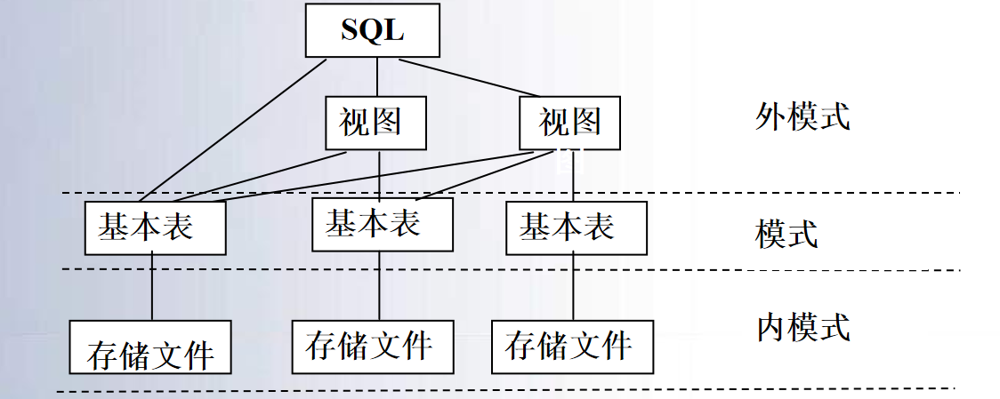
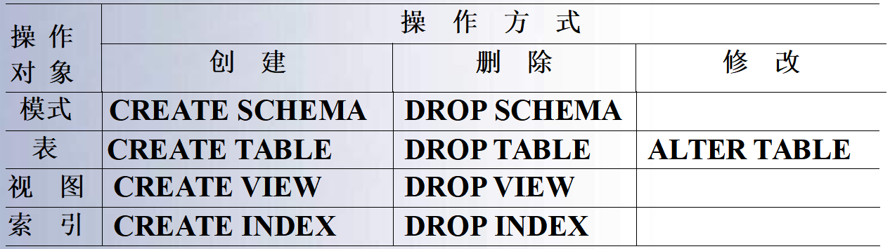
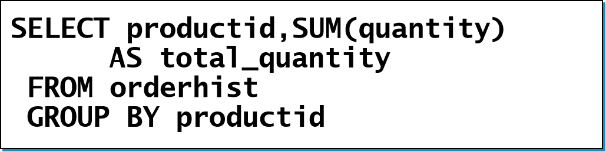
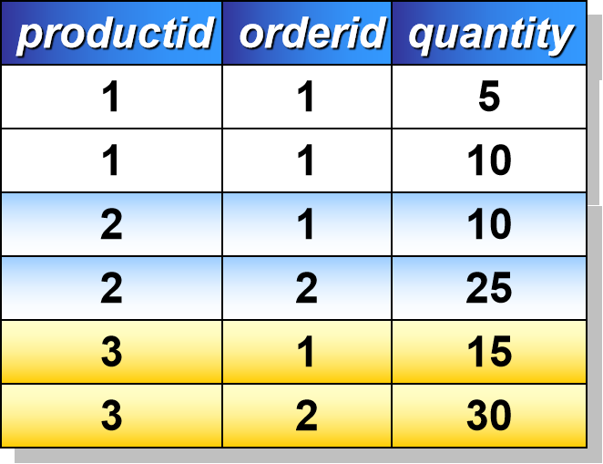
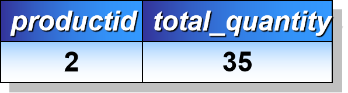
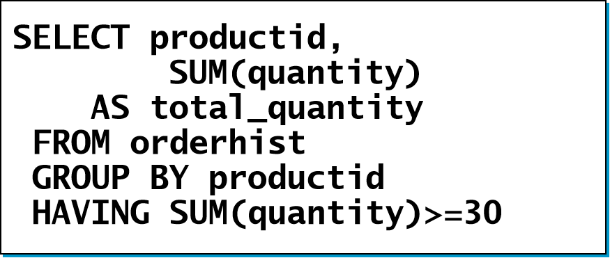
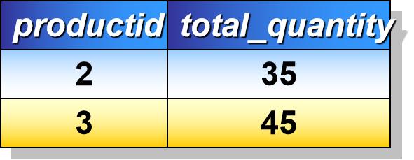
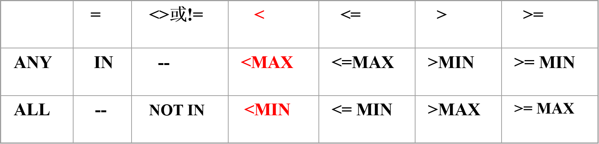

# 四、SQL

[TOC]

## SQL简介

- 结构化查询语言SQL（Structured Query Language）是一种介于关系代数与关系演算之间的语言，是一个通用的、功能极强的关系数据库语言，是关系数据库的标准语言。
- SQL语言的版本包括：
  - SQL-89，SQL-92，
  -  SQL-99(SQL3) 增加了面向对象的概念
  -  SQL2003(SQL4),
- SQL语言集==数据查询、数据操纵、数据定义和数据控制==功能于一体，充分体现了关系数据语言的特点和优点

> 回顾起第一章中所写的是数据定义，数据组织、存储和管理，数据操纵这些功能而已

### SQL的特点

- 综合统一
  - 集==数据定义语言DDL、数据操纵语言DML、数据控制语言DCL==的功能于一体，可以完成数据库生命周期中的全部活动。
  - 关系模型中实体和实体间的联系都用关系来表示，使得操作符单一，每种操作只使用一个操作符。
- 高度非过程化
  - 使用SQL语言，只需要提出“做什么”，而无需指明“怎么做”，无需了解存取路径，提高了数据的独立性
- 面向集合的操作方式
  - SQL语言采用集合操作方式，查询、插入、删除、修改操作的对象都是集合。

## SQL的系统结构

- SQL语言支持数据库的三级模式结构 
  - 在SQL中，关系模式称为基本表(Base Table)，基本表的集合形成数据库模式，对应三级结构中的模式
  - 基本表在物理上与存储文件相对应，所有存储文件的集合为物理数据库。
  - 外模式由视图(View) 组成（也包含了部分基本表）

|                        SQL的系统结构                         |
| :----------------------------------------------------------: |
|  |

## 数据定义

- SQL的数据定义功能主要包括定义表、定义视图和定义索引，在SQL2中还增加了对SQL数据库模式的定义 

|                SQL的数据定义语句                |
| :---------------------------------------------: |
|  |
|   此处的模式为命名空间，和之前提到的模式不同    |

### 建立索引

- 语句格式

```sql
CREATE [UNIQUE] [CLUSTER] INDEX <索引名>     
     ON <表名> (<列名>[<次序>][,<列名>[<次序>]]…)
```

- <表名>指定要建索引的基本表名字
- 索引可以建立在该表的一列或多列上，各列名之间用逗号分隔
- <次序>指定索引值的排列次序，升序ASC，降序DESC。缺省值：ASC
- UNIQUE表明此索引的每一个索引值只对应唯一的数据记录
- CLUSTER表示要建立的索引是聚簇索引

#### 索引选择

- 索引的选择是数据库设计中==最困难==的部分之一，需要估计对数据库上使用什么样的查询组合以及其他操作
  - 如果某个关系的==查询操作==比对它的==更新操作==多，那么建立在该关系上的索引具有较高的效率
  - 对于经常和查询where子句中的常量作比较的属性，以及频繁出现在连接条件中的属性应该建立索引
  - 更新操作频繁，创建索引要谨慎。需要仔细估算更新和查询数量的相对比例来决定索引的使用
  - 索引是内部技术实现，属于内模式的范畴

## 查询

- 语句格式

```sql
SELECT [ALL|DISTINCT] <目标列表达式> [，<目标列表达式>] …
FROM <表名或视图名>[， <表名或视图名> ] …
[ WHERE <条件表达式> ]
[ GROUP BY <列名1> [ HAVING <条件表达式> ] ]
[ ORDER BY <列名2> [ ASC|DESC ] ]
```

- SELECT子句：指定要显示的属性列
- FROM子句：指定查询对象(基本表或视图)
- WHERE子句：指定查询条件
-  GROUP BY子句：对查询结果按指定列的值分组，该属性列值相等的元组为一个组。通常会在每组中作用集函数。
- HAVING短语：筛选出只有满足指定条件的组
- ORDER BY子句：对查询结果表按指定列值的升序或降序排序 

### 单表查询

| WHERE子句常用的查询条件 | 具体                                                         |
| ----------------------- | ------------------------------------------------------------ |
| 比较表达式              | <列名1> 比较算符 <列名2（或常量）>比较算符：=、>、>=、<、<=、<>（或!=） |
| 逻辑表达式              | <条件表达式1> 逻辑算符 <条件表达式2>逻辑算符：AND、OR、NOT   |
| BETWEEN                 | <列名1> （NOT）BETWEEN <常量1或列名2> AND <常量2或列名3>     |
| IN                      | <列名>（NOT）IN （常量表列 或 SELECT语句）                   |
| LIKE                    | <列名>（NOT）LIKE ‘匹配字符串’匹配符：“_”表示匹配一个字符，“%”表示匹配任意字符串 |
| NULL                    | <列名> IS（NOT） NULL                                        |
| EXISTS                  | （NOT）EXISTS （SELECT语句）                                 |

### 空值

- SQL允许属性有一个特殊值NULL称作空值。
  - 未知值：有值但是不知道是什么，例如未知生日
  - 不适用的值：例如配偶的名字
  - 保留的值：无权知道的值，例未公布的电话号码
- 空值的运算
  - 空值不同于空白或零值。==没有两个相等的空值==。==空值和任何值进行算术运算，结果仍为空值==。
  - 执行计算时消除空值很重要，因为包含空值列的某些计算（如平均值）会不准确。 
  - 当使用逻辑运算符和比较运算符，有可能返回 结果 UNKNOWN， 是与TRUE 和 FALSE 相同的布尔值
- 空串指的是零长度字符串
- 当 m 为0或负数时，RIGHT('123', m) 返回空字符串RTRIM('     ') 返回空字符串。

### 使用集函数

- 主要集函数
  - 计数
    - COUNT（[DISTINCT|ALL] *）
    - COUNT（[DISTINCT|ALL] <列名>）
  - 计算总和       SUM（[DISTINCT|ALL] <列名>）
  - 计算平均值  AVG（[DISTINCT|ALL] <列名>）
  - 求最大值      MAX（[DISTINCT|ALL] <列名>）
  - 求最小值      MIN（[DISTINCT|ALL] <列名>）	
- DISTINCT短语：在计算时要取消指定列中的重复值
- ALL短语：不取消重复值;  ==ALL为缺省值==

### 对查询结果分组 

- 使用GROUP BY子句分组 	
- ==细化集函数的作用对象==
  -  未对查询结果分组，集函数将作用于整个查询结果
  -  对查询结果分组后，集函数将分别作用于每个组 
- 分组方法:按指定的一列或多列值分组,值相等的为一组
  - 使用GROUP BY子句后，==SELECT子句的列名列表中只能出现分组属性和集函数==

[例1]  求各个课程号及相应的选课人数。

```sql
SELECT Cno, COUNT(Sno)     
FROM SC
GROUP BY Cno；
```

[例2]  

|  |  |  |
| :----------------------------------------------------------: | :----------------------------------------------------------: | :----------------------------------------------------------: |
|  |  |  |

- GROUP BY子句的作用对象是==查询的中间结果表==
- 使用HAVING短语筛选最终输出结果
  - 只有满足HAVING短语指定条件的组才输出

[例1]  查询选修了3门以上课程的学生学号。

```sql
SELECT Sno
FROM  SC
GROUP BY Sno
HAVING  COUNT(*) >3
```

[例2]

|  |  |
| ------------------------------------------------------------ | ------------------------------------------------------------ |
|  |  |

-  HAVING短语与WHERE子句的区别
  - 作用对象不同
    - WHERE子句作用于==基表或视图==，从中选择满足条件的元组。
    - HAVING短语作用于==组==，从中选择满足条件的组 (group)
  - ==WHERE子句中不能使用集函数==；（集函数）
  - HAVING短语中可以使用集函数（集函数）

### 外连接（Outer Join）

- 外连接与普通连接的区别
  - 普通连接操作只输出满足连接条件的元组
  - 外连接操作以指定表为连接主体，==将主体表中不满足连接条件的元组一并输出==
- 外连接
  - 在表名后面加外连接操作符指定非主体表
  - 非主体表有一“万能”的虚行,该行全部由空值组成
  - 虚行可以和主体表中所有不满足连接条件的元组进行连接
  - 由于虚行各列全部是空值，因此与虚行连接的结果中，来自非主体表的属性值全部是空值 
- 左外连接列出左边关系中所有的元组
- 右外连接列出右边关系中所有的元组

### 嵌套查询概述

- 一个`SELECT-FROM-WHERE`语句称为一个查询块
- 将一个查询块嵌套在另一个查询块的WHERE子句或HAVING短语的条件中的查询称为嵌套查询

```sql
SELECT Sname	 
FROM Student 	-- 外层查询/父查询
WHERE Sno IN
(SELECT Sno FROM SC -- 内层查询/子查询
WHERE Cno= ' 2 ') 
```

- ==子查询的限制：不能使用ORDER BY子句==
- 层层嵌套方式反映了 SQL语言的结构化
- 有些嵌套查询可以用连接运算替代
- 嵌套查询的实现一般是从里到外，即先进行子查询，再把其结果用于父查询作为条件

### 嵌套查询分类及求解方法

#### 不相关子查询

- 子查询的查询条件不依赖于父查询
- 是==由里向外==逐层处理。即每个子查询在上一级查询处理之前求解，子查询的结果用于建立其父查询的查找条件。

#### 相关子查询

- 子查询的查询条件依赖于父查询
- 首先取外层查询中表的第一个元组，根据它与内层查询相关的属性值处理内层查询，若WHERE子句返回值为真，则取此元组放入结果表；
- 然后再取外层表的下一个元组；
- 重复这一过程，直至外层表全部检查完为止

### 引出子查询的谓词

- 带有IN谓词的子查询
- 带有比较运算符的子查询
- 带有ANY或ALL谓词的子查询
- 带有EXISTS谓词的子查询

#### 带有ANY或ALL谓词的子查询

- ANY和ALL谓词有时可以用集函数实现
- ANY与ALL与集函数的对应关系



- 用集函数实现子查询通常比直接用ANY或ALL查询效率要高，因为==前者通常能够减少比较次数==

#### 带有EXISTS谓词的子查询

1. EXISTS谓词
2. NOT EXISTS谓词
3. 不同形式的查询间的替换
4. 用EXISTS/NOT EXISTS实现全称量词
5. 用EXISTS/NOT EXISTS实现逻辑蕴函

### SELECT语句的一般格式

```sql
SELECT [ALL|DISTINCT]  
    <目标列表达式> [别名] [ ，<目标列表达式> [别名]] …
     FROM     <表名或视图名> [别名] 
              [ ，<表名或视图名> [别名]] …
      [WHERE <条件表达式>]
          [GROUP BY <列名1>[，<列名1’>] ...
          [HAVING     <条件表达式>]]
          [ORDER BY <列名2> [ASC|DESC] 
                   [，<列名2’> [ASC|DESC] ] …  ]
```

## 插入数据

- 两种插入数据方式
  -  插入单个元组
  -  插入子查询结果

- 插入单个元组语句格式

```sql
INSERT   INTO <表名> [(<属性列1>[,<属性列2 >…)]
VALUES (<常量1> [，<常量2>] … )
```

- 功能:将新元组插入指定表中。

## 修改数据

- 语句格式

```sql
UPDATE <表名> 
  SET 列名1=<表达式1>[,列名2=<表达式2>]
    [WHERE <条件表达式>]
```

- 功能：修改指定表中满足WHERE子句条件的元组
- 说明
  - SET子句：==指定修改方式==
    - 要修改的列
    - 修改后取值
  - WHERE子句：指定要修改的元组
    - 缺省表示要修改表中的所有元组

## 删除数据

- 语句格式

```sql
DELETE  FROM  <表名>
[WHERE <条件>]
```

- 功能
  - 删除指定表中满足WHERE子句条件的元组

- WHERE子句
  - 指定要删除的元组
  - 缺省表示要修改表中的所有元组

## 视图

- 视图的特点
  - ==虚表==,是从一个或几个基本表（或视图）导出的表
  - 只存放视图的定义，不会出现数据冗余
  - 基表中的数据发生变化,从视图中查询出的数据也改变

> 判断题考过：视图只能建立在基表上❌，而实际上也可以建立在视图上

- 基于视图的操作
  - 视图实际上提供了一种观察数据的逻辑窗口。对视图的操作意味着对基表进行相对应的操作。但对视图的更新(插入数据、删除、修改)有一些限制
  - 视图的定义是递归的，可以定义基于该视图的新视图

### 视图的定义

### 建立视图

```sql
CREATE  VIEW <视图名>  [(<列名> [,<列名>]…)]
AS  <子查询>
[WITH  CHECK  OPTION]
```

- SELECT语句表示子查询，但通常不允许包括ORDER BY子句和DISTINCT短语
- WITH CHECK OPTION
  - 通过视图进行增删改操作时，不得破坏视图定义中的谓词条件（即子查询中的条件表达式）
- DBMS执行CREATE VIEW语句时只是把视图的定义存入数据字典，并不执行其中的SELECT语句。在对视图查询时，==按视图的定义从基本表中将数据查出==

- 组成视图的属性列名==全部省略==或==全部指定==
- 省略: 
  - 由子查询中SELECT目标列中的诸字段组成
- 在下列情况下，必须命名 CREATE VIEW 中的列：
  1. 当列是从算术表达式、函数或常量派生的
  2. 两个或更多的列可能会具有相同的名称（通常是因为连接）
  3. 视图中的某列被赋予了不同于派生来源列的名称

- WITH CHECK OPTIOWN选项
- 通过视图插入、删除或修改元组时检查元组是否满足视图定义中的条件，如果不满足则拒绝执行
- 如果视图定义中含有条件，建议选择WITH CHECK OPTION选项，以约束更新的数据 

【例4-41】建立年龄小于23岁的学生视图，并要求数据更新时进行检查。

```sql
CREATE VIEW Sage_23
AS SELECT * 
FROM Student 
WHERE Sage < 23 
WITH CHECK OPTION 
```

- 当通过视图更新学生元组时，系统将检查所更新的学生年龄是否小于23岁，不满足条件时系统将拒绝执行更新操作 

### 视图上的操作

- 从用户角度：与基本表一样，通过视图可以对数据库执行查询和更新操作
- DBMS实现视图查询的方法
- 实体化视图（View Materialization）
  - 有效性检查：检查所查询的视图是否存在
  - 执行视图定义，将视图临时实体化，生成临时表
  - 查询视图转换为查询临时表
  - 查询完毕删除被实体化的视图(临时表)

- 视图消解法（View Resolution）
  - 进行有效性检查，检查查询的表、视图等是否存在。如果存在，则从数据字典中取出视图的定义
  - 把视图定义中的子查询与用户的查询结合起来，转换成等价的对基本表的查询
  - 执行修正后的查询

### 更新

- 对视图的数据插入、删除、修改最终转换为对基表的操作来进行
- 用户角度：更新视图与更新基本表相同
  - DBMS实现视图更新的方法
    - 视图实体化法（View Materialization）
    - 视图消解法（View Resolution）
- 指定WITH CHECK OPTION子句后
- DBMS在更新视图时会进行检查，防止用户通过视图对==不属于视图范围内==的基本表数据进行更新

【例4-48】通过视图Sage_23插入学生刘敏的信息（'20041' ,'刘敏' ,21,'女','数学'）。 

```sql
CREATE VIEW Sage_23
AS SELECT * FROM Student 
WHERE Sage < 23 
WITH CHECK OPTION;

INSERT INTO Sage_23 
VALUES ('20041' ,'刘敏' ,21,'女','数学')

-- 以上插入将转换成如下语句执行： 
INSERT INTO Student
       VALUES ('20041' ,'刘敏' ,21,'女','数学')
```

【例4-50】通过视图Sage_23删除学生王茵的记录。 

```sql
CREATE VIEW Sage_23
AS SELECT * FROM Student
WHERE Sage < 23 
WITH CHECK OPTION;

DELETE FROM Sage_23   WHERE Sname='王茵'
-- 该删除语句将转换为对基本表的操作：
DELETE FROM Student   
WHERE Sname='王茵' AND Sage < 23
```

### 更新视图的限制

一些视图是不可更新的，因为对这些视图的更新不能唯一地有意义地转换成对相应基本表的更新(对两类方法均如此)
【例4-49】通过视图D-Sage插入计算机系学生的平均年龄（'计算机'，21） 

```sql
CREATE VIEW D-Sage (Sdept, Avgage)
AS SELECT Sdept, AVG(Sage)
FROM Student 
GROUP BY Sdept；
```

```sql
-- 无论实体化法还是消解法都无法将其转换成对基本表的更新，视图D-Sage为不可更新视图
INSERT INTO D-Sage 
VALUES ('计算机',21)
```

【例4-51】通过视图CS_SC删除学生刘明亮的信息。 

```sql
CREATE VIEW CS_SC(Sno, Sname, Grade)
AS SELECT Student.Sno, Sname, Grade 
FROM Student, SC
WHERE Sdept='计算机' AND Student.Sno=SC.Sno AND SC.Cno=‘C2’
```

```sql
-- 不知是删除学生刘明亮的信息还是该学生的选课信息。删除操作涉及二个表，是不能执行的
DELETE FROM CS_SC
WHERE Sname='刘明亮'
```

### 视图的优点

1. 视图提供了数据的逻辑独立性 
   - 视图在一定程度上(只能在一定程度上)保证了数据的逻辑独立性
     - 由于视图更新是有条件的，因此应用程序中修改数据的语句可能仍会因基本表结构的改变而改变
2. 简化了用户视图
   - 定义视图能够简化用户的操作,适当的利用视图可以更清晰的表达查询
     - 基于多张表连接形成的视图
     - 基于复杂嵌套查询的视图
     - 含导出属性的视图
3. 视图使用户以不同角度看待相同的数 
   - 视图机制能使不同用户以不同方式看待同一数据，适应数据库共享的需要
4. 视图提供了安全保护功能 
   - 对不同用户定义不同视图，使每个用户只能看到他有权看到的数据
   - 通过WITH CHECK OPTION对关键数据定义操作时间限制

## SQL的数据控制

- SQL的数据控制功能包括
  - 数据的安全性 ——第6章
  - 数据的完整性 ——第7章
  - 数据恢复         ——第8章
  - 并发控制         ——第9章
- 本章介绍安全性中对数据的存取权限控制语句 
  - SQL中，权限通常是指使用SQL语句存取数据的权力， SQL提供了一套灵活的授权机制，哪些用户拥有对哪些数据的操作权限可以通过授权获得。 
    - 授权语句GRANT
    - 回收语句REVOKE 

### 授权

- 授权是指有授予权的用户将自己所拥有的权限授予其他用户 
- 授权语句格式为：

```sql
GRANT {<权限1>, <权限2>, …}
ON TABLE <表名或视图名>
TO {<用户名1>,<用户名2>, … | PUBLIC}
[WITH GRANT OPTION]
```

- 当有WITH GRANT OPTION短语时，被授权的用户还可以把获得的权限再授予其它用户 
- 一个GRANT语句可以把相应权限同时授予多个用户,用户名表如用短语PUBLIC代替，则表示把权限授予所有数据库的用户 

### 权限回收

- 具有授予权的用户可以通过回收语句将所授予的权限回收。
- 回收语句格式为：

```sql
REVOKE {<权限1>, <权限2>, …} 
ON TABLE <表名或视图名>
FROM {<用户名1>,<用户名2>, … | PUBLIC}
[RESTRICT|CASCADE]
```

- CASCADE选项表示回收权限时要引起级联操作，即拥有授予权（WITH GRANT OPTION）的用户如果把拥有的权限授予了其他用户，则要把转授出去的权限一起回收。
- RESTRICT选项表示，只有用户没有将拥有的权限转授给其他用户时才能回收该用户的权限，否则系统将拒绝执行。

### 嵌入式SQL

- SQL语言提供了两种使用方式：交互式、嵌入式
- 为什么要引入嵌入式SQL：
  - SQL语言是非过程性语言,事务处理应用需要高级语言
  - SQL是面向集合的，是非过程性的。而许多事务处理是过程性的，与上下文相关的，单纯使用SQL语句难以实现各种应用的全部功能。
- 为解决这一问题，SQL语言提供了嵌入式使用方式，
  - 将SQL语言嵌入到高级语言中，利用高级语言的结构性来弥补SQL语言实现复杂应用方面的不足，称为嵌入式SQL(Embedded SQL)，而嵌入SQL的高级语言称为主语言或宿主语言。

#### 将SQL语句嵌入到宿主语言中必须解决的问题

1. 编译嵌入主语言的SQL语句成为==可执行代码==
2. 数据库和主语言程序间的==通信==
3. 数据库和主语言程序间的==数据交换==
4. 需要协调==面向集合==和==面向记录==两种不同的处理方式 

##### 数据库和主语言程序间的数据交换

- 嵌入式SQL语句有输入变量和输出变量，用来与主语言进行数据交换。
  - 这些变量是主语言定义的程序变量，简称主变量(host variable)或宿主变量
- 输入主变量
  -  指定向数据库中插入的数据； 将数据库中的数据修改为指定值； 指定执行的操作
  -  指定WHERE子句或HAVING子句中的条件
- 输出主变量
  -  获取SQL语句的结果数据和SQL语句的执行状态

##### 需要协调面向集合和面向记录两种不同的处理方式

- 集合性操作语言与过程性操作语言的不匹配
  - ==SQL语言是面向集合的==，一条SQL语句原则上可以产生或处理==多条==记录
  - ==主语言是面向记录的==，一组主变量一次只能存放==一条==记录
  - 仅使用主变量并不能完全满足SQL语句向应用程序输出数据的要求
- 嵌入式SQL引入了==游标==的概念，用来协调这两种不同的处理方式
  - 游标是系统为用户开设的一个==数据缓冲区==，存放SQL语句的执行结果
  - 每个游标区都有一个名字，游标是可移动的。

