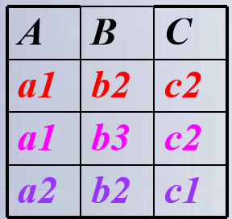

# 五、查询处理和查询优化

[TOC]

## 查询处理过程

| 流程                                                         | 步骤                                                         |
| ------------------------------------------------------------ | ------------------------------------------------------------ |
|  | <br /><br /><br /><br /> |

## 选择操作的实现

- 顺序扫描方法

  - 实现选择操作最简单的一种方法。

  - 该方法按照关系中元组的物理顺序扫描每个元组，检查该元组是否满足选择条件，如果满足则输出

  - 这种方法不需要特殊的存取路径，简单、有效，适用于任何关系，尤其适用于被选中的元组数占有较大比例或元组数较少的关系 

  - 代价估算如下：
    - 如果关系R的元组占用的块数为$B_R$（块是数据在磁盘和内存之间传递的单位 ），顺序扫描方法的代价$cost=B_R$。
    - 如果选择条件是==主键上的相等比较==操作，那么平均搜索一半的文件块才能找到满足条件的元组，因此平均搜索代价$cost=B_R/2$。

- 二分查找法
  - 如果选择条件涉及相等比较，并且物理文件是按照选择字段有序组织的，可以使用二分查找来定位
  - 二分查找法比顺序扫描方法有效。
    - 例如，字段Sno是排序属性，可以用二分查找法实现C2中的选择条件
  - ==如果选择是作用在非排序属性上,代价也会相应增加==
  - 代价估算如下：
    - 二分查找法是针对文件的物理块进行的，平均搜索代价为$\left \lceil log_2B_R \right \rceil $。
    - 如果选择是作用在非排序属性上，那么将会有多个块包含所需的元组，代价也会相应增加。

- 使用索引（或散列）的扫描方法
  - 适合选择条件中的属性上有索引(例如B+树索引或Hash索引) 
  - 通过索引先找到满足条件的元组指针，然后通过该指针继续检索满足查询条件的元组。

|  |  |  |
| ------------------------------------------------------------ | ------------------------------------------------------------ | ------------------------------------------------------------ |

- 索引扫描算法的代价估算公式：
  - ①如果选择条件是==相等比较==操作，需要存取索引树中从根结点到叶结点L块，再加上基本表中该元组所在的那一块，所以cost=L+1
  - ② 如果选择条件涉及==非主键属性的相等比较==，若为B+树索引，如果有S个元组满足条件，若每个满足条件的元组可能会保存在不同块上，最坏情况下cost=L+S。
  - ③如果比较条件是＞，＞＝，＜，＜＝操作，而且假设有一半的元组满足条件就要存取一半的叶结点，则代价估计cost=L+索引的叶结点数/2+元组占用的块数 /2 

## 连接操作的实现

- 连接操作是查询处理中最耗时的操作之一，操作本身开销大，并且可能产生很大的中间结果。
  - 嵌套循环法
  - 索引嵌套循环法
  - 排序合并法
  - 散列连接（Hash Join）法

### 嵌套循环法

|                              R                               |                              S                               |                            R × S                             |
| :----------------------------------------------------------: | :----------------------------------------------------------: | :----------------------------------------------------------: |
|  |  |  |

-  选择哪一个关系用于外循环、哪一个关系用于内循环会给连接的性能带来比较大的差异
-  一般使用==较少块的文件作为外循环==文件连接代价较小。
-  嵌套循环法==适用于任何条件==的连接   

### 索引嵌套循环法

- 在嵌套循环法中，如果两个连接属性中的一个属性上存在索引（或散列），可以使用索引扫描代替顺序扫描。
  - 例如，在关系S中的属性B上存在索引，
  - 则对于R中的每个元组(R为外表)，
    - 可以通过S的索引查找满足 s[B]＝ t[A]的所有元组
    - 而不必扫描S中的所有元组，以减少扫描时间
- 在一般情况下，索引嵌套循环法和嵌套循环法相比，查询的代价可以降低很多

### 排序合并法

- 适合连接的诸表已经排好序的情况 
- 排序合并法的步骤：
  - 如果连接的表没有排好序，先对Student表和SC表按连接属性Sno排序 
  - 取Student表中第一个Sno，依次扫描SC表中具有相同Sno的元组 ，当扫描到Sno不相同的第一个SC元组时，返回Student表扫描它的下一个元组
  - 再扫描SC表中具有相同Sno的元组，把它们连接起来 
  - 重复上述步骤直到Student 表扫描完

1.  ==Student表和SC表都只要扫描一遍==
2.  如果两个表原来无序，执行时间要加上对两个表的排序时间
3.  对于两个大表，先排序后使用排序合并法执行连接，总的时间一般仍会大大减少 

### 散列连接（Hash Join）法

- 把连接属性作为hash码，用同一个hash函数把R和S中的元组散列到同一个hash文件中
- 划分阶段(partitioning phase)：
  - 对包含较少元组的表(比如R)进行一遍处理
  - 把它的元组按hash函数分散到hash表的桶中

|  | <br /> |
| ------------------------------------------------------------ | ------------------------------------------------------------ |

- 试探阶段(probing phase)：也称为连接阶段(join phase) 
  - 对另一个表(S)进行一遍处理
  - 把S的元组散列到适当的hash桶中
  - 把元组与桶中所有来自R并与之相匹配的元组连接起来 

## 查询优化技术

查询优化的总目标：选择有效策略，求得给定关系表达式的值，使查询代价最小(实际上是较小) 

- 代数优化

  - 是关系代数表达式的优化

  - 按照一定的规则，改变代数表达式中操作的次序和组合，使查询执行更高效。

  - 只改变查询语句中操作的==次序和组合==，不涉及底层的存取路径 

- 基于存取路径的优化

  - 合理选择各种操作的存取路径以获得优化效果，

  - 需要考虑数据的物理组织和访问路径，以及底层操作算法的选择，

  - 涉及数据文件的组织方法、数据值的分布情况等，也称为物理优化 

- 基于代价估算的优化
  - 对于多个可选的查询策略, 通过估算执行策略的代价, 从中选择代价最小的作为执行策略

- 在实际的关系数据库中，查询优化的具体实现不完全相同，但往往都综合运用了这些优化技术，以获得较好的查询优化效果

### 优化的例子

【例 5‑2】查询选修“DataBase”课程的学生成绩。用SQL表达如下

```sql
SELECT  SC.Grade
	   FROM  Course，SC
	   WHERE Course.Cno=SC.Cno 
                      and Course.Cname='DataBase';
```

等价关系代数表达式
$$
\Pi_{Grade}(
    \sigma_{
    	Course.Cno=SC.Cno 
    	\wedge
    	Course.Cname='DataBase'
    }(
    	Course\times SC
    )
)
$$
用自然连接取代"笛卡尔积+选择"可以优化不少：
$$
\Pi_{Grade}(
    \sigma_{
    	Course.Cname='DataBase'
    }(
    	Course\Join SC
    )
)
$$
再把具体涉及某个表的选择操作移给它：
$$
\Pi_{Grade}(
	SC
	\Join
    \sigma_{
    	Course.Cname='DataBase'
    }(
    	Course 
    )
)
$$

### 计算处理时间

#### 优化前

具体存储过程，对于：
$$
\Pi_{Grade}(
    \sigma_{
    	Course.Cno=SC.Cno 
    	\wedge
    	Course.Cname='DataBase'
    }(
    	Course\times SC
    )
)
$$

- 首先在内存中尽可能多地装入Course表，留出一块存放SC的元组
- 然后，把SC中的每个元组和Course中的每个元组连接, 完成之后，继续读入下一块SC的元组，同样和内存中Course的每个元组连接，依此类推，直到SC表的元组全部处理完毕。
- 接下来，再把Course表中没有装入的元组尽可能多地装入内存，同样逐块装入SC表的元组去作元组的连接，直到Course表的所有元组全部进行完连接。 

- SC:10000条，Course:100条,满足条件的元组为100个
- 假设内存被划分为6块，每块能装10个Course元组或100个SC元组。每次在内存中放5块Course元组和1块SC元组 

①Course×SC


$$
\begin{align}
读取总块数 & = 读Course表的块数+读SC表的块数\\
& ＝ 读Course表的块数+ 读SC表遍数*每遍块数 \\ 
& = \frac{100}{10}+\frac{100}{10\times 5}\times\frac{10000}{100}\\ 
& = 10+200 \\ 
& = 210
\end{align}
$$


- ==读数据时间===210/20=10.5秒👈读写速度：20块/秒
- 中间结果大小 = 10000*100 = $10^6$       (条元组)
- ==写中间结果时间=== $10^6$ /10/20=5000秒 每块装10个元组

② $\sigma$ 需要将上一步已经连接好的$10^6$个元组重新读入内存，按照选择条件选取满足条件的元组。

- 假定内存处理时间忽略，读数据时间=5000秒  与写文件一样,忽略内存处理时间。
- 满足条件的元组为100个，可以全部放在内存

③ $\Pi$ 仍为100个元组，可以放在内存中，不需要作I/O操作，同样忽略内存处理时间

- 总时间 =10.5＋5000＋5000 = 10010.5秒= 2.78小时

|                             优化                             |
| :----------------------------------------------------------: |
| $\Pi_{Grade}(   \sigma_{  	Course.Cno=SC.Cno  	\wedge    	Course.Cname='DataBase'   }( 	Course\times SC    ))$ |
|    选择条件`Course.Cno = SC.Cno`与笛卡尔积组合成连接操作👇    |
| $\Pi_{Grade}(SC	\Join    \sigma_{    	Course.Cname='DataBase'    }(    	Course     ))$ |
| 条件`Course.Cname =‘DataBase’ `移到连接操作中的关系Course中👇 |
| $\Pi_{Grade}(	SC	\Join    \sigma_{   	Course.Cname='DataBase'    }(    	Course     ))$ |
|     每一次变换都使参加连接的元组大大减少，这就是代数优化     |

#### 优化后

对于
$$
\Pi_{Grade}(	SC	\Join    \sigma_{   	Course.Cname='DataBase'    }(    	Course     ))
$$
假设SC表在Cno上有索引，
 ① $\sigma$

- 读Course表总块数= 100/10=10块
- 读数据时间 =10/20=0.5秒
- 中间结果大小1条  不必写入外存

②$\Join$

- 不用读取全部的SC元组，而只需要读入与课程名“DataBase”相对应的课程代码Cno相同的那些元组，那么读入SC的元组数将从10000降到100，
- 总块数= 100/100＝1块 
- 读数据时间 =1/20=0.05秒

③$\Pi$

- 基于索引扫描的方法能进一步提高查询的性能，这就是物理优化

## 代数优化策略

- (1)在关系代数表达式中==尽可能早地执行选择操作==。
  - 目的：==减小中间关系==  在优化策略中这是最重要、最基本的一条
- (2) ==投影运算和选择运算同时进行==
  - 目的：避免重复扫描关系
    - 如有若干投影和选择运算，并且它们都对同一个关系操作，则可以在扫描此关系的同时完成所有的这些运算以避免重复扫描关系
- (3)==将投影运算与其前面或后面的二元运算结合==
  - 目的：减少扫描关系的遍数（为去掉某些属性而扫描一遍关系）

- (4) 把某些==选择==同在它前面要执行的==笛卡尔积==结合起来成为一个==连接==运算

$$
\sigma_{Student.Sno=SC.Sno}(Student\times SC)\\
\Downarrow  \\  
Student \Join SC
$$

- 在执行连接操作前对关系适当进行预处理
  - 按连接属性排序
  - 在连接属性上建立索引

【例 5‑3】查询选修了“DataBase”这门课程的计算机学院的学生姓名。用SQL语句表达如下

```sql
SELECT  Student.Sname
	   FROM  Student，SC， Course
	   WHERE  Student.Sno=SC.Sno and Course.Cno= SC.Cno 
           and Student.Dept='计算机学院' and Course.Cname='DataBase'
```

| (1) 把SQL语句转换成查询树                                    | (2) 转换成关系代数语法树                                     |
| :----------------------------------------------------------- | :----------------------------------------------------------- |
|  |  |
| （3）对查询树进行优化<br />变换选择运算 ,得到单独的4个选择操作。尽可能将选择操作移到树的叶端： | （3）对查询树进行优化(续)<br/>- 每一双目运算$(\times,\Join,\cup,-)$和它所有的直接祖先为一组(这些直接祖先是$\sigma, \Pi$运算)<br/>- 如果其后代直到叶子全是单目运算，则也将它们并入该组<br/>- 把上述得到的语法树的内节点分组，得到优化后的查询树 |
|  |  |

## 连接操作的启发

- 可以选用嵌套循环方法，并选择其中较小的表，确切地讲是占用存储块数较少的表，作为外表（外循环的表）。

- 理由：
  - 设连接表R与S分别占用的块数为$B_R$与$B_S$
  - 连接操作使用的内存缓冲区块数为K
  - 分配K-1块给外表
  - 如果R为外表，则嵌套循环法存取的块数为

$$
B_R + \frac{B_R}{K-1}B_S
$$

- 显然应该选==块数小的表作为外表== 
