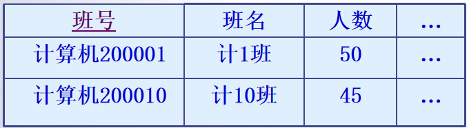
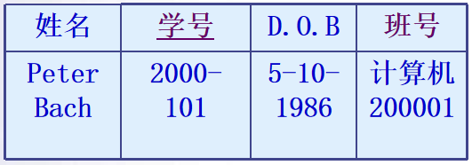

# 七、数据库的完整性

[TOC]

## 数据库的完整性概述概述

- 数据库的完整性
  - ==数据的正确性和相容性==
    - 防止数据库中存在不符合语义的数据，也就是防止数据库中存在不正确的数据
    - 防范对象：不合语义的、不正确的数据
- 数据的安全性
  - 保护数据库防止恶意的破坏和非法的存取
  - 防范对象：非法用户和非法操作

- 数据库的完整性是一种语义概念，
  - 防止数据库中存在
    - 不符合语义的数据，
    - 不正确的数据
  - 保证数据库中数据的质量。 
- 为维护数据库的完整性，DBMS必须：
  - 提供定义==完整性约束条件==的机制
  - 提供==完整性检查==的方法
  - ==违约==处理

## 完整性约束条件

- （1） 列级约束
  - 主要是对属性的数据类型、数据格式和取值范围、精度等的约束。具体包括：
    - 对==数据类型==的约束，包括数据类型、长度、精度等的约束。例如学生姓名的数据类型是字符型，长度是8。
    - 对==数据格式==的约束，例如规定日期的格式为YYYY/MM/DD
    - 对==取值域==的约束，例如学生成绩的取值范围必须是0～100。
    - 对==空值==的约束 

- （2） 元组约束
  - 一个元组是由若干个属性组成的，元组级约束就是元组中各个属性之间的约束关系。例如订货关系中发货日期不能小于订货日期，发货量不得超过订货量等。
- （3） 关系约束
  - 关系约束是指一个关系的各个元组之间、或者多个关系之间存在的各种联系或约束。常见的关系约束有实体完整性约束、参照完整性约束、函数依赖约束、统计约束等。

## 实现数据完整性的方法

- 在关系数据库系统中，数据完整性控制策略包括规则、默认值、约束、触发器和存储过程等。

  - (1) 默认值
    - 如果在插入行中没有指定列的值，那么默认值指定列中所使用的值，例如：自动增长值，内置函数、数学表达式等

  - (2) 约束

    - 约束是自动强制数据完整性的方法。

    - 约束定义关系列中允许值的规则，是通用的强制完整性的标准机制。

    - 使用约束优于使用触发器、规则和默认值。

  - (3) 规则
    - 规则是大多数数据库系统中一个向后兼容的功能，用于执行一些与CHECK约束相同的功能。规则以单独的对象创建，然后绑定到列上。

  - (4) 触发器
    - 触发器是数据库系统中强制业务规则和数据完整性的主要机制

- 声明式数据完整性👉通过声明保证数据完整性
  - 作为对象定义的一部分来定义数据必须达到的标准
  - DBMS 自动强制完整性
  - 通过使用==约束、默认和规则==来实现
- 过程式数据完整性👉通过代码保证数据完整性
  - 在脚本中定义数据必须达到的标准
  - 在脚本中强制完整性
  - 通过使用==触发器==和==存储过程==来实现
  - 可在客户端或服务器用其他编程语言和工具来实现

## 实体完整性

- 实体完整性规则规定：
  - ==主键的值不能取空值==
  - ==主键的值唯一==
- 实现方法：通过对主键值的约束实现实体完整性。 
- 实体完整性的定义
  - 关系模型的实体完整性
    - CREATE  TABLE中用PRIMARY KEY定义
  - ==单属性==构成的主键有两种说明方法 
    - 定义为列级约束条件、定义为表级约束条件
  - 对==多个属性==构成的主键只有一种说明方法
    - 定义为表级约束条件 

- 定义表的主键后，每当对该表插入一条记录或者对主键进行更新操作时，DBMS自动进行实体完整性的检查
  - 检查主键是否唯一，
    - ==如果不唯一则拒绝进行插入或修改==；
  - 检查主键的各个属性（字段）值是否为空
    - ==如果有空的字段值，则拒绝操作==，从而保证实体完整性。

## 参照完整性

- 参照完整性定义
  - 关系模型的参照完整性定义
    - 用FOREIGN KEY短语定义哪些列为外键,
    - 用REFERENCES短语指明外键参照哪些表的主键

> 判断题考过课本原话：参照完整性约束不仅存在于关系之间，同一个关系内部属性之间也会有参照约束关系。

【例 7‑6】定义SC中的参照完整性

```sql
CREATE TABLE SC
( 
    Sno    CHAR(9)  NOT NULL, 
    Cno     CHAR(4)  NOT NULL,  
    Grade    SMALLINT,
    PRIMARY KEY (Sno, Cno),  
    FOREIGN KEY (Sno) REFERENCES Student(Sno),  
    FOREIGN KEY (Cno) REFERENCES Course(Cno)    
);
```

## 主表与从表

- 主表：指外键在另一张表中作主/候选键的表。（例中的班级表）
- 从表：指含有外键的表,（例中的学生表）

|                        班级表（主表）                        |                       学生表 （从表）                        |
| :----------------------------------------------------------: | :----------------------------------------------------------: |
|  |  |

## 分析外键约束（主表👉从表）

- 对主表进行三种操作，观察对表间完整性的影响：
  - 对主表中的主键进行操作
  - ==插入==：要求插入值满足主键限制即可，不影响其它表
  - ==修改==：可能会影响与该主键相关的从表的外键值。当相应的外键值存在时，有两个策略可用：
    - 一是改变对应从表的所有外键值，使之与主键一致；
    - 其二是不允许修改主表中的主键值。（反正就是不能改主表）
  - ==删除==：可能会影响与该主键相关的从表的外键值。若相应的外键值存在时，策略有二：
    - 一是不允许删除主表的主键值；
    - 二是级联删除从表中相应外键值所在的行。

- 对从表中的外键操作
  - 插入：要求插入的外键值应“参照”（Reference）主表中的主键值。 
  - 修改：要求修改的外键值“参照”主表中的主键值 
  - 删除：不需要参照主表中的主键值。

## 参照完整性检查和违约处理

- 参照关系中外键空值的问题
  - 需要定义外键是否允许为空值 
  - 如果外键是其主键的组成部分，外键值不允许为空
  - 否则可以根据具体的语义确定外键值是否允许空值 
- ==在参照关系中插入==元组的问题(修改操作与之类似)
  - 受限插入
    - 向titles中插入新的元组，但该元组的pub_id属性值在表publishers中不存在，则系统拒绝
  - 级联(CASCADE)插入
    - 首先向被参照关系插入相应的元组，其主键值等于参照关系插入元组的外键值，然后再向参照关系插入该元组 
- 在被参照关系中删除元组的问题

  - 级联删除（CASCADES） 
  - 受限删除（RESTRICTED）
  - ==置空值==删除

> 考题：当数据更新操作出现破坏参照完整性而使数据不一致时，系统可采用的策略有级联删除、受限删除和置空值

- 这三种方法都保证了参照完整性约束，但具体哪种方法正确，取决于应用环境的语义，需要根据实际应用的业务规则决定具体的违约处理措施 
-    如果想让系统采用其他的策略则必须在创建表时显式地加以说明 

## 触发器

- 数据库系统一般提供两种主要机制来实现业务规则和数据完整性
  - 约束
    - 完整性约束机制在检测出违反约束条件的操作后,只能作==简单的动作==，例如，拒绝操作。
  - 触发器
    - 触发器是用户定义在关系数据表上的一类由事件驱动的==特殊过程==，用==编程==的方法实现复杂的业务规则
    - 触发器比约束更加==灵活==，可以实现一般的数据完整性约束实现不了的复杂的完整性约束，具有更精细和更强大的数据控制能力。
    - 触发器常常用于强制业务规则和数据完整性。 

- 触发器是一种特殊类型的存储过程，在对表或视图发出 UPDATE、INSERT 或 DELETE 语句时自动执行 
- 可用触发器完成很多数据库完整性保护的功能 
  - 实现复杂的业务规则
  - 实现比CHECK 约束更复杂的数据完整性。
  - 比较数据修改前后的状态
  - 维护非规范化数据

- SQL使用CREATE TRIGGER命令创建触发器，其一般格式为

```sql
CREATE TRIGGER <触发器名>  
     { BEFORE | AFTER} <触发事件> ON <表名>
        FOR EACH  {ROW | STATEMENT}
       ［WHEN <触发条件>］
          <触发动作体>
```

- 定义触发器的语法说明:

  - 创建者：表的拥有者

  - 触发器名，表名：触发器的目标表

  - 触发事件：INSERT、DELETE、UPDATE

  - 触发时间 

    - BEFORE

      - 表示在==触发事件进行以前==，判断触发条件是否满足。

      - 若满足条件则先执行触发动作部分的操作，

      - 然后再执行触发事件的操作。 

    - AFTER

      - 表示在==触发事件完成之后==，判断触发条件是否满足。

      - 若满足条件则执行触发动作部分的操作。

      - 如果触发事件因错误(如违反约束或语法错误)而失败，触发器将不会执行 

  - 触发器类型

    - ==行级==触发器(FOR EACH ROW)。
      - 对每一个修改的元组都会触发触发器的检查和执行 

    - ==语句级触发器(FOR EACH STATEMENT)。==
      - 只在SQL语句执行时候进行触发条件的检查和触发器的执行 

  - 触发条件
    - 触发条件为真，省略WHEN触发条件

  - 触发动作体

    - 触发动作体是满足触发器条件后，执行的一系列数据库操作。

    - 如果触发动作体==执行失败==，激活触发器的事件就会终止执行，触发器的目标表或触发器可能影响的其他对象不发生任何变化 

例如Teacher表上创建一个AFTER UPDATE触发器。如果表Teacher有1000行，执行如下语句：

```sql
UPDATE Teacher SET Deptno=5;
```

- 如果该触发器为语句级触发器，那么执行完该语句后,触发动作只发生一次;
- 如果是行级触发器，触发动作将执行1000次 

## SQL Server中的触发器

- 用途
  - 在数据库中的相关表上==实现级联更改==
    - 引用完整性可以通过外键约束定义，但可使用触发器在级联更新或删除时确保采用适当的行为。
    - 若触发表上定义了约束，它们在触发器执行之前检查。若违反了约束，则触发器不执行
  - 强制比 CHECK 约束更复杂的数据完整性
  - 定义用户定制的错误信息
    - 通过使用触发器，可以在特定条件出现时调用预定义或动态定义的定制错误信息
    - 约束、规则和默认只能通过标准系统错误信息来表达错误。若需要定制信息或更复杂的错误处理,需要使用触发器
  - 维护非标准数据，特别是处理较为复杂的逻辑

- 触发器与CHECK 约束
  - CHECK 约束只能根据逻辑表达式或==同一表中==的另一列来验证列值。
    - 如果应用程序要求根据另一个表中的列验证列值,则必须使用触发器。
  - 约束只能通过标准的系统错误信息传递错误信息。
    - 如果应用程序要求使用（或能从中获益）自定义信息和较为复杂的错误处理，则必须使用触发器
  - 触发器可以引用其它表中的列
    - 例如，触发器可以包含使用 Transact-SQL 代码的复杂处理逻辑。因此，触发器可以支持约束的所有功能；但并不总是最好的方法。

- inserted表和deleted表
  - Inserted表
    - 存放insert或update语句执行过程中,插入到触发表中的新数据行的副本
    - inserted 表中的行是和触发表中的新数据行相同.
  - Deleted表
    - 存放delete 或update语句执行过程中,从触发表中删除的旧数据行的副本
    - deleted表和触发表不会有相同的行.
  - 触发操作完成后,与触发器相关的表被==自动删除掉==

【例 7‑9】创建限制更新数据的触发器，限制将SC表中不及格学生的成绩改为及格。

```sql
CREATE TRIGGER tri_grade
	ON SC FOR UPDATE
	AS 
        IF UPDATE (Grade)
	    	 IF EXISTS (SELECT * FROM INSERTED JOIN DELETED 
		      ON INSERTED.Sno = DELETED.Sno
		WHERE INSERTED.GRADE >= 60 AND DELETED.Grade < 60)
           BEGIN
               RAISERROR ('不允许将不及格学生的成绩改为及格！')
		    ROLLBACK
           END
```

