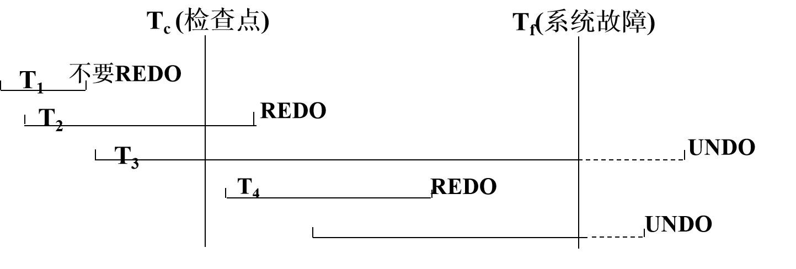
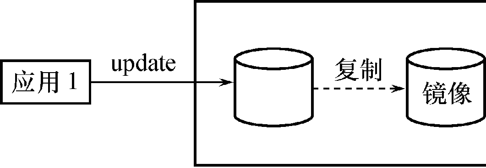

# 八、数据库恢复技术

[TOC]

## 事务的基本概念和特征

- 事务(Transaction)是用户定义的一个数据库操作序列，这些操作要么全做，要么全不做，是一个不可分割的工作单位
- 事务是一系列的数据库操作，事务是恢复和并发控制的基本单位。
- 事务和程序是两个概念
  - 在关系数据库中，一个事务==可以是一条SQL语句==，==一组SQL语句或整个程序==
  - 一个应用程序通常包含多个事务
- 事务处理技术主要包括数据库恢复技术和并发控制技术

### 事务的基本概念

- 如何定义事务
  - 显式定义方式
  - 隐式方式：当用户没有显式地定义事务时，DBMS按缺省规定自动划分事务

```sql
BEGIN TRANSACTION
SQL 语句1
......
COMMIT
```

```sql
BEGIN TRANSACTION
SQL 语句2
......
ROLLBACK
```

- COMMIT   提交事务
  - 事务正常结束 ,提交事务的所有操作（读+更新）,事务中所有对数据库的更新永久生效
-  ROLLBACK  回滚事务
  - 事务异常终止
    - 事务运行的过程中发生了故障，不能继续执行
  - 回滚事务的所有更新操作,恢复到事务开始时的状态

### 事务特征

- 事务的四个特性：
  - 原子性（Atomicity）、一致性（Consistency）、隔离性（Isolation）、持续性（Durability ），简称==ACID特性==
- 原子性（Atomicity）
  - 事务是数据库的逻辑工作单位，事务中包括的诸操作要么都做，要么都不做
- 一致性（Consistency）
  - 事务执行的结果必须是使数据库从一个一致性状态变到另一个一致性状态
  - 一致性状态：数据库中只包含成功事务提交的结果
  - 不一致状态：数据库中包含失败事务的结果

----

| 银行转帐：从帐号A中取出一万元，存入帐号B。<br/> |  |
| ----------------------------------------------- | ------------------------------------------------------------ |

- 定义一个事务，该事务包括两个操作
- 这两个操作要么全做，要么全不做
  - 全做或者全不做，数据库都处于一致性状态。
- 如果只做一个操作，数据库就处于不一致性状态

---

- 隔离性

  - 对并发执行而言,一个事务的执行不能被其他事务干扰

  - 一个事务内部的操作及使用的数据对其他并发事务是隔离的

  - 并发执行的各个事务之间不能互相干扰

| T1的修改被T2覆盖了！ |  |
| -------------------- | ------------------------------------------------------------ |

- 持续性
  - 持续性也称永久性（Permanence）
  - 一个事务一旦提交，它对数据库中数据的改变就应该是永久性的。
  - 接下来的其他操作或故障不应该对其执行结果有任何影响。

## 事务状态

- 事务应该处在下列状态之一： 

  - ==活动状态（active）==
    - 初始状态，事务执行时事务处于活动状态。
  - ==部分提交状态（partially committed）==
    - 事务最后一条语句被执行完毕后进入部分提交状态
    - 事务中对数据的操作已经全部完成，但结果数据还驻留在内存中。
    - 如果在此状态时，系统出现故障仍可能使事务不得不终止
  - ==失败状态（failed）==
    - 如果事务不能正常执行，事务就进入失败状态。
    - 这意味着事务没有成功地完成，必须回滚。
    - 回滚(Rollback)就是撤消事务已经做出任何数据更改

  - ==终止状态（aborted）==
    - 事务回滚并且数据库已经恢复到事务执行前的状态。

  - ==提交状态（committed）==
    - 当数据库系统将事务中对数据的更改完全写入磁盘时，写入一条事务日志信息，标志着事务成功完成，这时事务就进入了提交状态。 

|  | 事务状态转移图 |
| ------------------------------------------------------------ | -------------- |

- 事务从活动状态开始，当==完成最后一条语句后==进入部分提交状态
- 此刻，事务虽已完成，但结果数据仍驻留在内存中，某些故障可能导致其失败
- 把结果数据写入外部存储器中，事务进入提交状态
- 当事务不能正常执行时，进入失败状态
- 失败状态的事务必须撤消，事务进入中止状态

## 数据库恢复的必要性

- 数据库系统可能发生各种各样的故障，大致可分为：
  - 系统故障
  - 事务内部的故障
  - 存储设备故障
  - 其它原因

## 恢复的实现技术

- 数据恢复的基本原理
  - ==数据冗余==:    利用存储在系统其它地方的冗余数据来重建数据库中已被破坏或不正确的那部分数据
- 恢复机制涉及的关键问题
  - 如何建立冗余数据
    - 数据转储（backup）
    - 登记日志文件（logging）
  - 如何利用这些冗余数据实施数据库恢复
- 建立冗余数据最常用的技术是
  - ==数据转储==和==登记日志文件==
  - 通常在一个数据库系统中，这两种方法一起使用

## 数据转储

- 数据转储是数据库恢复中采用的基本技术
  - DBA定期地将整个数据库复制到磁带或另一个磁盘上保存起来的过程。
    - 这些备用的数据文本称为后备副本或后援副本
  - 数据库遭到破坏后可以将后备副本重新装入
    - 重装后备副本只能将数据库恢复到转储时的状态


## 基于日志的数据库恢复

- 数据库系统日志文件
  - 记录有关事务的数据库操作信息 
  - 日志文件的格式
    - 以记录为单位的日志文件
    - 以数据块为单位的日志文件 
  - 日志文件内容
    - 事务标识，操作类型，操作对象，更新前后的数据值 
    - 两条原则：登记的次序严格按并行事务执行的时间次序；必须先写日志文件，后写数据库

### 日志文件内容

- 以记录为单位的日志文件
  -  < Start Ti>，表示事务Ti开始。 
  - <Ti， Xj，V1，V2>，表示事务Ti对数据项Xj执行写操作。旧值是V1,新值是V2。  
  - < Commit Ti>，表示事务Ti已提交。事务对数据库所做的任何更新都写入到数据缓冲区中，通常不能确定磁盘是否已经进行更新 
  - < Abort Ti>，表示事务Ti已中止。表明事务不能成功完成。如果事务中止，系统将确保这一事务的更新不会对数据库造成影响 

### 日志文件的作用

- ==事务故障恢复==和==系统故障恢复==必须用日志文件
- ==介质故障恢复==必须用日志文件
  - 在动态转储方式中必须建立日志文件，后备副本与该日志文件综合起来才能将数据库恢复到一致性状态
  - 与静态转储后备副本配合进行==介质故障恢复==
    - 静态转储的数据已是一致性的数据
    - 如果静态转储完成后，仍能定期转储日志文件，则在出现介质故障重装数据副本后，可以利用这些日志文件副本对已完成的事务进行重做处理
    - 可以把数据库恢复到故障前某一时刻的正确状态（不必重新运行那些已完成的事务程序）

- 为保证数据库是可恢复的，登记日志文件时必须遵循两条原则
  - 登记的次序严格按并行事务执行的时间次序
  - 必须==先写日志文件，后写数据库==
    - 写数据库和写日志文件是两个不同的操作，
    - 在这两个操作之间可能发生故障，如果先写了数据库修改，而在日志文件中没有登记下这个修改，则以后就无法恢复这个修改了
    - 如果先写日志，但没有修改数据库，按日志文件恢复时只不过是多执行一次不必要的UNDO操作，并不会影响数据库的正确性

- 写日志文件操作：把表示这个修改的日志记录写到日志文件
- 写数据库操作：把对数据的修改写到数据库中

### 使用日志恢复数据库

- 基于日志的恢复技术：

  - Redo技术
    - 在日志中记录所有数据库写修改操作， 
    - 如果发生故障，可以用Redo操作重做事务，恢复已完成的事务 

  - Undo恢复技术

    - 在事务执行过程中修改了数据库而事务还没提交

    - 此时如果系统崩溃，可以利用Undo恢复技术（撤销事务）

    - 将被修改的数据项恢复到事务开始前的状态。 

  - Undo操作的过程

    - 检查日志文件，寻找事务Ti执行write(X)操作前写入日志的记录， 

    - 把数据库中的X项的值重新修改为更新前的旧值

    - 如果事务Ti有多个write操作，Undo write操作的顺序必须与write操作时写入

## 事务故障的恢复

- 事务故障：事务在运行至正常终止点前被中止
- 恢复方法：利用日志文件撤销事务对数据的更改，系统回滚到事务执行前的状态 
- 事务故障的恢复由系统自动完成，不需要用户干预
  - (1) 反向扫描文件日志，查找该事务的更新操作。
  - (2) 对该事务的更新操作执行逆操作。即将日志记录中“更新前的值”（Before Image, BI）写入数据库。
  - (3) 继续反向扫描日志文件，查找该事务的其他更新操作，并做同样处理。
  - (4) 如此处理下去，直至读到此事务的开始标记，事务故障恢复就完成了。

- 系统故障造成数据库不一致状态的原因
  - 一些未完成事务对数据库的更新已写入数据库
  - 一些已提交事务对数据库的更新还留在缓冲区没来得及写入数据库
- 恢复方法
  - Undo 故障发生时未完成的事务
  - Redo 已完成的事务
- 系统故障的恢复由系统在==重新启动时==自动完成，不需要用户干预

## 系统故障的恢复步骤

- (1) 正向扫描日志文件（即从头扫描日志文件）
  - Redo队列:在故障发生前已经提交的事务
  - Undo队列:故障发生时尚未完成的事务
- (2) 对Undo队列事务进行UNDO处理
  - 反向扫描日志文件，对每个UNDO事务的更 新操作执行逆操作
- (3) 对Redo队列事务进行REDO处理
  - 正向扫描日志文件，对每个REDO事务重新执行登记的操作

## 介质故障的恢复

- 恢复方法
  - 重装数据库，使数据库恢复到一致性状态
  - 重做已完成的事务
- 介质故障的恢复需要DBA介入
  - 重装最近转储的数据库副本和相关日志文件副本
  - 执行系统提供的恢复命令
  - 具体的恢复操作仍由DBMS完成

### 利用静态转储的副本进行故障恢复


- 系统在Ta时刻停止运行事务，进行数据库转储
- 在Tb时刻转储完毕，得到Tb时刻的数据库一致性副本
- 系统运行到Tf时刻发生故障
- 为恢复数据库，首先由DBA重装数据库后备副本，将数据库恢复至Tb时刻的状态
  - 重新运行自Tb～Tf时刻的所有更新事务，把数据库恢复到故障发生前的一致状态
- 可以利用这些日志文件副本对已完成的事务进行重做处理

### 利用动态转储的副本进行故障恢复


- 利用动态转储得到的副本进行故障恢复
- 需要把动态转储期间各事务对数据库的修改活动登记下来，建立日志文件
- 后备副本加上日志文件才能把数据库恢复到某一时刻的正确状态

## 介质故障恢复步骤（两步走）

- (1) 装入最新的后备数据库副本，使数据库恢复到最近一次转储时的一致性状态。
  - 对于==静态转储==的数据库副本，装入后数据库即处于一致性状态
  - 对于==动态转储==的数据库副本，还须同时装入转储时刻的日志文件副本,利用与恢复系统故障相同的方法(即REDO+UNDO),才能将数据库恢复到一致性状态
- (2) 装入有关的日志文件副本，重做已完成的事务。
  - 首先扫描日志文件，找出故障发生时已提交的事务的标识，将其记入重做队列。
  - 然后正向扫描日志文件，对重做队列中的所有事务进行重做处理。即将日志记录中“更新后的值”写入数据库。

## 检查点恢复技术

- 检查点（checkpoint）是记录在日志中表示数据库==是否正常运行==的一个标志 ，以记录所有当前活动的事务
- 检查点记录的内容
  - 1. 建立检查点时刻所有正在执行的事务清单
  - 2. 这些事务最近一个日志记录的地址
- 建立检查点原则
  - 定期：按照预定的一个时间间隔
  - 不定期：按照某种规则，如日志文件已写满一半建立一个检查点
- 数据库恢复时，利用检查点能判定哪些事务是正常结束的，从而确定恢复哪些数据以及如何进行恢复
- 重启动文件记录各个检查点记录在日志文件中的地址
- 周期性的建立检查点，动态维护维护日志文件
  - 把日志缓冲区中的内容写入日志文件； 
  - 在日志文件中写入一个检查点记录；
  - ==把数据库缓冲区的内容写入数据库；==
  - 把检查点记录在日志文件中的地址写入重启动文件

> 这里也考过，顺序肯定是写日志为第一步、接着写检查点记录、接着写入数据库、接着写重新开始文件


- 使用检查点方法可以改善恢复效率
  - 当事务T在一个检查点之前提交
    - 由检查点记录知， T对数据库所做的修改已写入数据库，在进行恢复处理时，没有必要对事务T执行REDO操作
  - ==只运行检查点记录之后的操作即可==

- 系统出现故障时，恢复子系统将根据事务的不同状态采取不同的恢复策略 

|  | 恢复策略👇                                       |
| ------------------------------------------------------------ | ----------------------------------------------- |
| T1：在检查点之前提交
T2：在检查点之前开始执行，在检查点之后故障点之前提交
T3：在检查点之前开始执行，在故障点时还未完成
T4：在检查点之后开始执行，在故障点之前提交
T5：在检查点之后开始执行，在故障点时还未完成 |  |

## 数据库镜像恢复技术

> 数据库镜像是指在不同的设备上同时存在两份数据库，一个是主设备，另一个是镜像 设备。所谓镜像的含义是指每当主设备的数据库发生更新时，系统自动更新镜像设备的数据，使得两个设备的数据始终保持一致。数据库镜像技术可用于存储设备故障的恢复，一 旦主设备出现故障，可以由镜像设备继续提供数据。
>
> --考简答题

- 介质故障是对系统影响最为严重的一种故障
  - 介质故障恢复比较费时
  - 为预防介质故障，DBA必须周期性地转储数据库
- 提高数据库可用性的解决方案,数据库镜像(Mirror) 
  - DBMS自动把整个数据库或其中的关键数据复制到另一个磁盘上
  - DBMS自动保证镜像数据与主数据的一致性
    - 每当主数据库更新时，DBMS自动把更新后的数据复制过去



## 小结

- 恢复的基本原理
  - 利用存储在后备副本、日志文件和数据库镜像中的冗余数据来重建数据库
- 常用恢复技术
  - 事务故障的恢复  UNDO
  - 系统故障的恢复  UNDO + REDO
  - 介质故障的恢复
    - 重装备份并恢复到一致性状态+REDO
- 提高恢复效率的技术
  - 检查点技术
    - 可以提高系统故障的恢复效率
    - 可以在一定程度上提高利用动态转储备份进行介质故障恢复的效率
  - 镜像技术：镜像技术可以改善介质故障的恢复效率