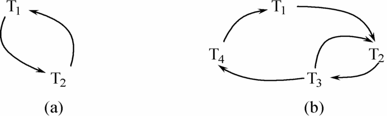
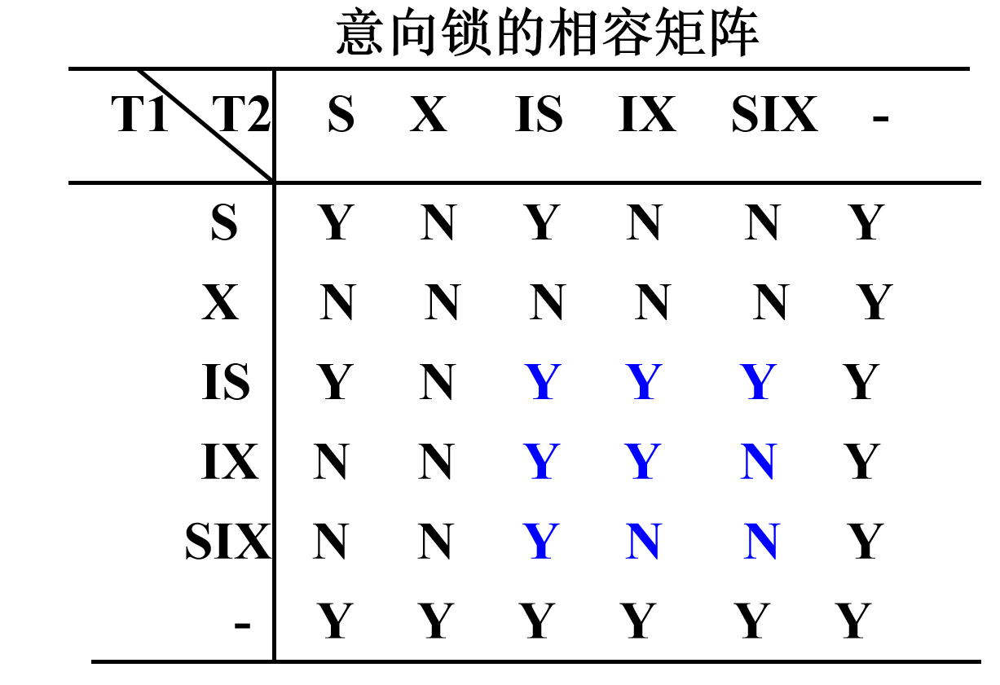
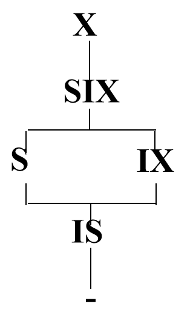

# 九、并发控制

[TOC]

## 问题提出

- 多事务执行方式(续)
  - (1)事务串行执行
  - (2)交叉并发方式interleaved concurrency
    - 并行事务的并行操作轮流交叉运行
    - 是单处理机系统中的并发方式，能够减少处理机的空闲时间，提高系统的效率
  - (3)同时并发方式simultaneous  concurrency
    - 多处理机系统中，每个处理机可以运行一个事务，多个处理机可以同时运行多个事务，实现多个事务真正的并行运行
    - 最理想的并发方式受制于硬件环境、更复杂的机制

## 并发事务运行存在的异常问题

### 1. 丢失更新

- 以飞机定票系统为例， 
  甲售票点事务T1和乙售票点事务T2同时读取某航班的机票余额R=100 ；
  - 分别售出1张机票
    结果明明卖出两张机票，数据库中机票余额只减少1
- 丢失更新是指
  - 事务1与事务2从数据库中读入同一数据并修改
  - 事务2的提交结果破坏了事务1提交的结果，导致事务1的修改被丢失。

### 2. 不可重复读

- 不可重复读是事务T1读取数据后，T2对同一数据执行更新操作，使T1再次读取该数据时，得到与前一次不同的值。 

- 三类不可重复读：
- ​    事务1读取某一数据后：
  - T2对其做了修改,当T1再次读该数据时,得到与前一次==不同的值==
  - T2删除了其中部分记录，当T1再次读取数据时，==某些记录消失==
  - T2插入了一些记录，当T1再次按相同条件读数据时, ==多了一些记录==
  - 后两种不可重复读有时也称为==幻影现象==（phantom row）（多了一些值和少了一些值都称为幻影现象）

### 3. 读“脏”数据

- 事务1修改某一数据，并将其写回磁盘
- 事务2读取同一数据后,事务1由于某种原因被撤消，这时事务1已修改过的数据恢复原值
- 事务2读到的数据就与数据库中的数据不一致，是不正确的数据，又称为“脏”数据。

### 异常问题

并发操作带来的数据不一致性
1. 丢失更新（lost update）
2. 不可重复读(non-repeatable read)
3. 读“脏”数据(dirty read)

|                           丢失更新                           |                          不可重复读                          |                          读“脏”数据                          |
| :----------------------------------------------------------: | :----------------------------------------------------------: | :----------------------------------------------------------: |
|  |  |  |

- 这种数据库的不一致性是由并发操作引起的，主要原因是==并发操作破坏了事务的隔离性==
  - 并发控制机制要用正确的方式调度并发操作，使一个用户事务的执行不受其他事务的干扰，避免造成数据的不一致性 
    - 保证事务的==隔离性==
    - 保证数据库的==一致性==

## 并发调度的可串行性

- 计算机系统对并行事务中并行操作的调度是随机的，而不同的调度可能会产生不同的结果。

- ==将所有事务串行起来的调度策略是正确的调度策略==。

- 如果一个事务运行过程中没有其他事务在同时运行，也就是说它没有受到其他事务的干扰，那么就可以认为该事务的运行结果是正常的或者预想的

- ==以不同的顺序串行执行事务也有可能会产生不同的结果==，但由于不会将数据库置于不一致状态，所以==都可以认为是正确的==

### 可串行化调度

定义9.1 多个事务的并发执行是正确的，当且仅当并发执行的结果与这些事务按某一串行顺序执行的结果相同,这种调度策略被称为==可串行化调度==。

==可串行化是并发事务正确调度的准则== 。

- 可串行性是并行事务正确性的唯一准则
- 按这个准则规定，一个给定的并发调度，当且仅当它是可串化的，才认为是正确调度
- 例：现在有两个事务，分别包含下列操作：
  - 事务1：读B；A=B+1；写回A；
  - 事务2：读A；B=A+1；写回B；
  - 假设A的初值为2，B的初值为2。
- 对这两个事务的不同调度策略
  - 串行执行
    - (a)串行调度策略、 (b)串行调度策略
  - 交错执行
    - (c)不可串行化的调度、 (d)可串行化的调度

### 调度的冲突等价性

- 冲突操作
  - 冲突操作是指==不同的事务对同一个数据的读写操作和写写操作==
    - Ri(x)与Wj(x)	          /* 事务Ti读x，Tj写x*/
    - Wi(x)与Wj(x)	          /* 事务Ti写x，Tj写x*/
  - 其他操作是不冲突操作
  - 不同事务的冲突操作和同一事务的两个操作不能交换(Swap) 

定义9.2  如果一个调度S能通过一系列==非冲突操作==执行顺序的交换变成调度S1，则称==调度S和S1冲突等价==。 

【例 9-3】证明调度S是否是可串行化调度。
$$
S=R_1(A)W_1(A)R_2(A)W_2(A)R_1(B)W_1(B)R_2(B)W_2(B)
$$

- S=R1(A)W1(A)<u>R2(A)</u>**W2(A)**==R1(B)W1(B)==R2(B)W2(B)

- 把**W2(A)**与==R1(B)W1(B)==交换，得到：
- R1(A)W1(A<u>)R2(A)</u>==R1(B)W1(B)==**W2(A)**R2(B)W2(B)

- 再把<u>R2(A)</u>与==R1(B)W1(B)==交换：
- L= R1(A)W1(A)==R1(B)W1(B)==<u>R2(A)</u>**W2(A)**R2(B)W2(B)
- 因为L等价于一个串行调度T1，T2
- 所以调度S是可串行化的调度
  - L和S是(冲突)==等价的== 

> 也就是可以看到将下标顺利分成左边全为1右边全为2，我们就认为这个调度是可串行化的调度

### 调度的状态等价性

定义9.4 我们称一个调度是状态==可串行的==，如果它的状态等价于一个串行调度。

- 可串行化调度的充分条件
  - 一个调度S在保证冲突操作的次序不变的情况下, 通过交换两个事务不冲突操作的次序得到另一个调度S’ , 如果S’是串行的, 称调度S为==冲突可串行化的调度==

- 一个调度是冲突可串行化，一定是==状态可串行==的（可串行化的调度）
  - 冲突可串行化调度是可串行化调度的充分条件，不是必要条件。还有不满足冲突可串行化条件的可串行化调度

[例]有3个事务

T1=<u>W1(Y)W1(X)</u>，T2===W2(Y)W2(X)==，T3=**W3(X)**

调度L1=<u>W1(Y)W1(X)</u>==W2(Y)W2(X)== **W3(X)**是一个串行调度

调度L2=W1(Y)==W2(Y)W2(X)==W1(X)**W3(X)**不满足冲突可串行化

- 因为每对操作都是冲突的，不能交换
- 但是调度L2是可串行化的。因为L2执行的==结果==与调度L1==相同==，Y的值都等于T2的值，X的值都等于T3的值 

## 锁

- 确切的控制是由封锁的类型决定的。
  - 共享锁（Share lock，简记为S锁,又称为==读锁==）
    -  若事务T对数据对象A加上S锁，则其它事务只能再对A加S锁，而不能加X锁，直到T释放A上的S锁
    - 保证其他事务可以获得对象A的S锁、读取A，但在T释放A上的S锁之前不能对A做任何修改 
  - 排它锁（eXclusive lock，简记为X锁,又称为==写锁==）
    - 若事务T对数据对象A加上X锁，则只允许T读取和修改A，其它任何事务都不能再对A加任何类型的锁，直到T释放A上的锁

### 锁的相容矩阵

|  | Y，相容的请求
<br />N，不相容的请求 |
| ------------------------------------------------------------ | ---------------------------------- |

- 列表示事务T1已经获得的数据对象上的锁的类型，其中横线表示没有加锁。
- 行表示事务T2对同一数据对象发出的封锁请求
- T2的封锁请求能否被满足用矩阵中的Y和N表示
  - Y表示事务T2的封锁要求与T1已持有的锁相容，封锁请求可以满足
  - N表示T2的封锁请求与T1已持有的锁冲突，T2的请求被拒绝

## 封锁协议

- 封锁协议
  - 运用封锁方法时，对数据对象加锁时需要约定一些规则 
    - 何时申请封锁
    - 持锁时间
    - 何时释放封锁等

### 1．一级封锁协议

事务T在修改数据A前必须==先对其加X锁==，直到事务结束才释放 ：

-  符合一级封锁协议
-  没有丢失修改 

| ✔没有丢失更新                                                | ❌保证可重复读                                                | ❌不读“脏”数据                                                |
| ------------------------------------------------------------ | ------------------------------------------------------------ | ------------------------------------------------------------ |
|  |  |  |

- 一级封锁协议在==读数据时不加锁==，所以不能保证可重复读和不读“脏”数据。

### 2．二级封锁协议

- 二级封锁协议规定：
  - ==在一级封锁协议基础上==,事务T在读数据A之前必须先对其加S锁，读完后即可释放S锁 
  - 增加二级封锁协议的目的是==防止读“脏”数据== 

| ✔没有丢失更新                                                | ❌保证可重复读                                                | ✔不读“脏”数据                                                |
| ------------------------------------------------------------ | ------------------------------------------------------------ | ------------------------------------------------------------ |
|  |  |  |

### 3．三级封锁协议

- 三级封锁协议：
  - ==在二级封锁协议基础上==，某一事务施加的S锁要保持到该事务结束时才释放。 

|  | ✔没有丢失更新<br />✔不读“脏”数据<br />✔保证可重复读 |
| ------------------------------------------------------------ | --------------------------------------------------- |

### 一致性保证 

|              | X锁          | 👈            | S锁          | 👈            | 一致性保证 | 👈          | 👈        |
| ------------ | ------------ | ------------ | ------------ | ------------ | ---------- | ---------- | -------- |
|              | 操作结束释放 | 事务结束释放 | 操作结束释放 | 事务结束释放 | 不丢失修改 | 不读脏数据 | 可重复读 |
| 一级封锁协议 |              | √            |              |              | √          |            |          |
| 二级封锁协议 |              | √            | √            |              | √          | √          |          |
| 三级封锁协议 |              | √            |              | √            | √          | √          | √        |

## 活锁

封锁技术可以有效地解决并行操作的一致性问题，但也带来一些新的问题：死锁，活锁

- 活锁：在数据库系统中活锁是指某个事务由于请求封锁，但总也得不到锁而==长时间处于等待状态==


- 如何避免活锁
  - 采用先来先服务的策略：
    - 当多个事务请求封锁同一数据对象时,按请求封锁的先后次序对这些事务排队
    - 该数据对象上的锁一旦释放，首先批准申请队列中第一个事务获得锁。

## 死锁

死锁是指在同时处于等待状态的两上或多个事务中相互封锁了对方请求的资源，使得没有任何一个事务可以获得足够的资源运行完毕，而永远等待下去。

|  | - 如事务T1，已封锁了数据R1，而事务T2，封锁了数据R2，
- T1又继续请求封锁R2，因T2已经封锁了R2，因而T1等待T2释放R2；
- 接着而T2又继续请求封锁R1，因T1已经封锁了R1，因而T2等待T1释放R1。
- T1、T2相互等待对方释放锁，形成死锁 |
| ------------------------------------------------------------ | ------------------------------------------------------------ |

解决死锁的方法

1. 预防死锁
2. 允许死锁发生
死锁的诊断与解除

### 预防死锁

- 分析产生死锁的原因
  - 两个或多个事务都已封锁了一些数据对象，
  - 然后又都请求对已被其他事务封锁的数据对象加锁
  - 出现死等待。
- 预防死锁的发生就是要破坏产生死锁的条件
- 预防死锁的方法
  -  一次封锁法
  -  顺序封锁法
  - 事务重试法 

### 死锁的检测与恢复

- 允许死锁发生

- 解除死锁

  - 由DBMS的并发控制子系统定期检测系统中是否存在死锁
  - 一旦检测到死锁，就要设法解除
    - 选择一个处理死锁代价最小的事务，将其撤消,释放此事务持有的所有的锁，使其它事务能继续运行下去。
    - 被撤销的事务需要回滚

- 事务等待图法

  - 用事务等待图动态反映所有事务的等待情况

  - 事务等待图是一个有向图G=(V，U)

    - V为结点的集合，每个结点表示正运行的事务

    - U为边的集合，每条边表示事务等待的情况

  - 若V1等待V2，则V1，V2之间画一条有向边，从V1指向V2

  - 并发控制子系统周期性地（比如每隔1 min）检测事务等待图，如果发现图中存在回路，则表示系统中出现了死锁。



> 只要破坏环就可以解锁了。

## 两阶段封锁协议

- 两阶段封锁协议(Two-Phase Locking，简称2PL)是最常用的一种封锁协议
  - 理论上可以证明使用两段封锁协议产生的是可串行化调度

- 两阶段封锁协议指所有事务必须分两个阶段对数据项加锁和解锁

  - 在对任何数据进行读、写操作之前，事务首先要获得对该数据的封锁

  - 在释放一个封锁之后,事务不再获得任何其他封锁

- ==两阶段封锁协议是保证并发调度可串行性的封锁协议==

- “两阶段”锁的含义:事务分为两个阶段
  - 第一阶段是获得封锁，也称为扩展阶段。
    - 在这阶段,事务可以申请获得任何数据项上的任何类型的锁，但是不能释放任何锁
  - 第二阶段是释放封锁，也称为收缩阶段。
    - 在这阶段,事务可以释放任何数据项上的任何类型的锁，但是不能再申请任何锁。

例：事务1遵守两阶段封锁协议，事务2不遵守两阶段封锁协议

```sql
Slock A ... Slock B ... Xlock C ... Unlock B ... Unlock A ... Unlock C
Slock A ... Unlock A ... Slock B ... Xlock C ... Unlock C ... Unlock B
```

- 并行执行的所有事务均遵守两阶段封锁协议，则对这些事务的所有并行调度策略都是可串行化的。
  - 所有遵守两阶段封锁协议的事务，其并行执行的结果一定是正确的
- 事务遵守两段锁协议是可串行化调度的==充分条件==，而==不是必要条件==
  - 可串行化的调度中，不一定所有事务都必须符合两阶段封锁协议。

- 两阶段封锁协议与防止死锁的一次封锁法
  - 一次封锁法要求每个事务必须一次将所有要使用的数据全部加锁，否则就不能继续执行，因此一次封锁法遵守两段锁协议
  - 但是两阶段封锁协议并不要求事务必须一次将所有要使用的数据全部加锁，因此遵守两阶段封锁协议的事务可能发生死锁

| 遵守两阶段封锁协议的事务发生死锁 |  |
| -------------------------------- | ------------------------------------------------------------ |

## 多粒度封锁

- 选择封锁粒度的原则
  - 封锁的粒度越                  大，小，
  - 系统被封锁的对象         少，多，
  - 并发度                             小，高，
  - 系统开销                         小，大，
  - 选择封锁粒度考虑封锁机构和并发度两个因素，对系统开销与并发度进行权衡
    - 需要处理多个关系的大量元组的用户事务：以数据库为封锁单位；
    - 需要处理大量元组的用户事务:以关系为封锁单元
    - 只处理少量元组的用户事务：以元组为封锁单位

- 多粒度树
  - 以树形结构来表示多级封锁粒度
  - 根结点是整个数据库，表示最大的数据粒度
  - 叶结点表示最小的数据粒度
- 例：三级粒度树。根结点为数据库，数据库的子结点为关系，关系的子结点为元组。


- 多粒度封锁协议
  - 允许多粒度树中的每个结点被独立地加锁
  - 对一个结点加锁意味着这个==结点的所有后裔结点也被加以同样类型的锁==
  - 在多粒度封锁中一个==数据对象可能以两种方式封锁==，封锁的效果是一样的
    - 显式封锁: 直接加到数据对象上的封锁
    - 隐式封锁: 由于其上级结点加锁而使该数据对象加上了锁

- 系统检查封锁冲突时    怎么办？
  - 要检查显式封锁、还要检查隐式封锁
  - 对某个数据对象加锁时系统检查的内容
    - 该数据对象：
      - 有无显式封锁与之冲突
    -  所有上级结点
      - 检查本事务的显式封锁是否与该数据对象上的隐式封锁冲突 ——==由上级结点封锁造成的==
    - 所有下级结点
      - 检查本事务的隐式封锁是否与该数据对象上的显式封锁冲突——==将加到下级结点的封锁==

### 意向锁

- 引进意向锁（intention lock）目的
  - 提高对某个数据对象加锁时系统的检查效率
- 什么是意向锁
  - 对任一结点加基本锁，必须先对它的上层结点加意向锁
- 如果对一个结点加意向锁，则说明该结点的下层结点正在被加锁
- 例：对任一元组 t 加锁，先对关系R加意向锁

|  |  |
| ------------------------------------------------------------ | ------------------------------------------------------------ |

- 意向共享锁(Intent Share Lock，简称IS锁)
  - 如果对一个数据对象加IS锁，表示它的后裔结点拟(意向)加S锁。例:要对某个元组加S锁，则要先对关系和数据库加IS锁
- 意向排它锁(Intent Exclusive Lock，简称IX锁)
  - 如果对一个数据对象加IX锁，表示它的后裔结点拟(意向)加X锁。例:要对某个元组加X锁，先要对关系和数据库加IX锁
- 共享意向排它锁(Share Intent Exclusive Lock,简称SIX锁)
  - 如果对一个数据对象加SIX锁，表示对它加S锁，再加IX锁，即SIX = S + IX。例：对某个表加SIX锁，则表示该事务要读整个表（所以要对该表加S锁），同时会更新个别元组（所以要对该表加IX锁）

### 意向锁的相容矩阵

> 在理解相容矩阵时可以这样去理解而不用死记硬背：
>
> X：写全表
>
> IX：写其中某一行
>
> S：读全表
>
> IS：读其中某一行
>
> SIX：读全表而写其中某一行
>
> 这样就很方便理解下面矩阵了，而且也很经得起推敲，比如
>
> IX和SIX是否相容：
>
> 一个事务申请写其中某一行，另外一个事务申请读全表，肯定不相容；
>
> IX和IX是否相容：
>
> 一个事务申请写其中某一行，另一个事务申请写其中某一行，相容（只要不是同一行）；

|                       意向锁的相容矩阵                       |                      锁的强度的偏序关系                      |
| :----------------------------------------------------------: | :----------------------------------------------------------: |
|  |  |
|                   针对于两个事务所申请的锁                   |                        针对于一个事务                        |

- 锁的强度
  - 锁的强度是指它对其他锁的排斥程度
  - 一个事务在申请封锁时以强锁代替弱锁是安全的，反之则不然

- 具有意向锁的多粒度封锁方法
  - 申请封锁时应该按自上而下的次序进行；
  - 释放封锁时应该按自下而上的次序进行   
- 例如：事务T1要对关系R1加S锁
  - 要首先对数据库加IS锁
  - 检查==数据库和R1==是否已加了不相容的锁(X或IX)
  - 不再需要搜索和检查==R1中的元组==是否加了不相容的锁(X锁) 

