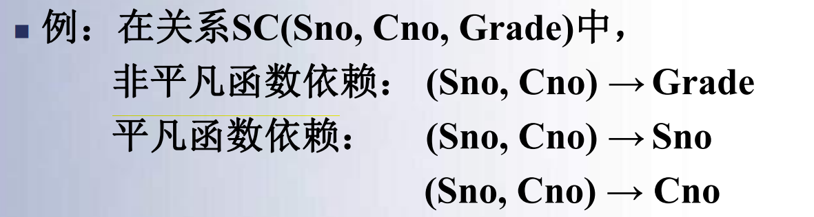
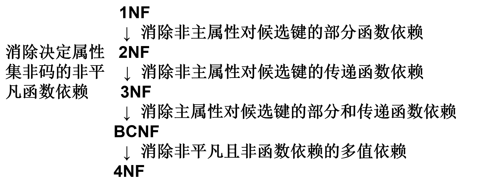

# 十、关系数据库设计理论

[TOC]

> 感觉这章就是教你怎么设计表的，怎么拆表~

## 关系模型的存储异常

- 关系模型的==存储异常==
  - 数据冗余 
    - 大量的数据冗余不仅造成存储空间的浪费，而且存在着潜在的数据不一致
  - 插入异常
  - 删除异常
  - 更新异常

## 函数依赖的定义

- 函数依赖(Functional Dependency, FD)是现实世界中最广泛存在的一种数据依赖，

  - 是现实世界属性间相互联系的抽象;
  - 是数据内在的性质;
  - 它表示了关系中属性间的一种制约关系。

1. 函数依赖
2. 平凡函数依赖与非平凡函数依赖
3. 完全函数依赖与部分函数依赖
4. 传递函数依赖

> $X\rightarrow Y$
>
> X为最小的属性集可以推出Y就是完全函数依赖，否则就是部分函数依赖；
>
> Y依赖于X，若Y中有X中没有的属性（$Y \not\subset X $），则叫非平凡函数依赖；若Y中的属性都是X中有的属性（$Y \subset X $），那么就叫平凡函数依赖
>
> | 完全、不完全                                                 | 非平凡、平凡                                                 |
> | ------------------------------------------------------------ | ------------------------------------------------------------ |
> |  |  |

- 定义10.1  设关系模式R(U)，$X,Y\subseteq U$，r是R(U)上的任一关系。
- 对任意元组$t_1 ,t_2\in r$, 如果t1、t2在X上的属性值相等， t1、t2在Y上的属性值亦相等，
  - 则称X函数决定Y,或Y函数依赖于X，记为FD X→Y
  - 称X为决定因素，或称X为函数依赖的左部，
  - 称Y为函数依赖的右部。 

## 函数依赖的蕴涵性

- 一个关系模式R上的任一关系r(R)，在任意给定的时刻都有它所满足的一组函数依赖集F。
  - 若关系模式R上的任一关系都能满足一个确定的函数依赖集F，则称F为R满足的==函数依赖集== 
- ==对于给定的一组函数依赖，需要判断另外一些函数依赖是否成立==。例如,已知关系模式R上的函数依赖集为F, F中有函数依赖X→Y，X→Z，问X→YZ是否成立。
  - 这是==函数依赖的逻辑蕴涵==所要研究的问题
- 定义10.5  设函数依赖集F和关系模式R(U)，属性集$X,Y\subseteq U$，关系模式R满足F 。如果关系模式R满足FD X→Y，则称F==逻辑蕴涵==FD X→Y，或称X→Y逻辑蕴涵于F。记为 F |= X→Y。 

- 定义10.6   设函数依赖集F，所有被F逻辑蕴涵的函数依赖称为==F的闭包==，记为$F^+$。
  - F+ 可表示为：F+ = { X→Y|  所有F ==蕴涵==的FD  X→Y} 
- 定义10.7 设关系模式R（U，F），U是R的属性全集，F是R的函数依赖集，X是U的子集。如果满足条件：
  - (1) $X \rightarrow U\in F^+$；
  - (2) 不存在$X'\subset X$且 $X' \rightarrow U\in F^+$成立。

则称X为模式R的一个候选键。

> (2)的满足就是保证了最小的属性集，如果没有2就是超键的定义

## 属性闭包

- 定义10.8  设关系模式R(U, F)，U={A1,A2,…,An}，$X\subseteq U$。所有用公理推出的函数依赖X→Ai中Ai的属性集合称为==属性集X关于函数依赖集F的闭包==，记为$X_{F^+}$。

$$
X_{F^+}=\{A_i  | 所有用公理由F推出的X→A_i\}
$$

- 显然，由自反律知道$X\subseteq X_{F^+}$ 。
- 例如，设R(A, B, D, E, H)，
  R上的函数依赖集F={A→D，AB→DE，E→H}
- 若X={A}，$(A)_{F^+} =AD$。 
- 若X={AB}，$(AB)_{F^+} =ABDEH$。

- 有了属性闭包的概念，就可以从$X_{F^+}$中看出某个函数依赖X→Y是否能够用公理从F中推出。

## Armstrong公理

- 函数依赖的公理系统是模式分解算法的理论基础，
  - 从一组函数依赖求得蕴含的函数依赖
  - 求给定关系模式的关键字 
- Armstrong公理 
  - 设关系模式R(U，F)，并且X、Y、Z和W是U的子集
  - A1  自反律(Reflexivity) 【平凡函数依赖】
    - 若$Y\subseteq X\subseteq U$, 则 F |= X→Y；
  - A2  增广律(Augmentation) 
    - 若X→Y且$Z\subseteq U$，则 F |= XZ→YZ；
  - A3  传递律(Transitivity)
    - 若X→Y, Y→Z，则 F |= X→Z.

> 自反律说明了多属性的X可以推自己的属性子集
>
> 增广律说明了多并上一列不影响原来的依赖关系
>
> 传递律说明了依赖可以传递

## 求属性闭包的算法

- 算法10.1 计算属性集X关于F的闭包XF+ 
- 输入:模式R的属性全集U,U上的函数依赖集F,属性集X
- 输出：属性集X的闭包XF+
- 方法：计算$ X^{(i)}$$(i=0, 1, \ldots )$
  - (1) 初值 $X^{(0)}$ = X，i=0；
  - (2) $X^{(i+1)} $ = $ X^{(i)}$ ∪Z；其中，
- 属性集$Z=\{A | 存在V→W\in F, V\subseteq X^{(i)}且A\in W而A \notin X^{(i)}\}$
  - (3) 判断$X^{(i+1)} $ = $ X^{(i)}$或$X^{(i+1)}$ =U是否成立，若成立转(5)
  - (4) $i=i+1$，转(2)；
  - 输出$X_{F^+}$的结果$ X^{(i+1)}$

- 循环次数
  - 令 $a_i=|X^{(i)}|$，$\{a_i\}$形成一个步长大于1的严格递增的序列，序列的上界是|U|，因此算法最多循环|U|-|X|。

【例10-1】设关系模式R(U,F), U={A,B,C,D,E,G},      F={ AB→C,BC→D,ACD→B,D→EG,BE→C,CE→AG},求 (BD)+

- 解：令X={BD}  (1) 初值 $(X)^{(0)} $={BD} 
-    (2) 在F中寻找左部是BD子集的函数依赖，D→EG满足条件。结果为：$(X)^{(1)} $={BDEG}。$X^{(0)}$ $\neq$ $X^{(1)}$。 
- 在F中继续寻找左部是BDEG子集的函数依赖，得 BE→C，C不包含在BDEG中，结果为$ (X)^{(2)}$={BCDEG}
- 在F中继续寻找左部是BCDEG子集的函数依赖，得BC→D，CE→AG。这里仅有右部属性A是未出现在$ (X)^{(2)}$ 中的属性，结果为 $ (X)^{(3)}$={ABCDEG}。
- $X^{(3)}$ $\neq$  $X^{(2)}$，虽然F中还有未考察过的函数依赖，但$X^{(3)}$ 已包含了R中的所有属性，结束。
- 输出结果：(BD)+ = {ABCDEG} 

> 只要F中的函数依赖的左部属性包含在中间结果$X^{(i)} $中，就可以将没有出现在$X^{(i)}$中的右部属性A并入$X^{(i)}$中。X→A显然成立

## 关系模式的规范化

- 定义10.15 如果关系模式R的==每一个属性对应的域值都是不可再分==的，称模式R属于==第一范式==，简记为R$\in $1NF

> 想象一点就是Typora中打不出的表格，只能用html打出的表格。

- 定义10.16  设关系模式R，A是R中的属性，F是R上的函数依赖集。如果A包含在R的某个候选键中，称A为主属性，否则称A为非主属性。

> 候选键中包含的属性称为主属性。

- 定义10.17  如果一个关系模式R$\in $1NF，且所有非主属性都==完全依赖==于R的每个候选键，则R$\in$2NF。  

> 2NF规定了非主属性完全依赖候选键（区别于部分依赖）

- 定义10.18  设R$\in $1NF，若在R中没有非主属性传递依赖于R的候选键，则关系模式R$\in$3NF 。如果数据库模式R中每一关系模式都是3NF，则数据库模式R$\in$3NF 

> 3NF规定了没有非主属性到候选键的传递依赖

- 定义10.19   若R$\in$1NF，而且R中==没有任何属性传递依赖于R中的任一关键字==，则关系模式R属于Boyce-Codd范式（BCNF）。如果数据库模式R中的每个关系模式R都属于BCNF，则数据库模式R$\in$BCNF 

> 没有传递依赖
>
> BCNF不但排除了非主属性对主属性的传递依赖，也排除了==主属性间的传递依赖==

- 定义10.20 设关系模式R$\in$1NF，F是R上的函数依赖集,对于F中的每一个函数依赖X→Y，必有X是R的一个候选键，则R$\in$BCNF 
  - 如果R$\in$BCNF，则R上的每一个函数依赖中的，==每个决定因素都包含侯选键== 

- 3NF与BCNF的关系
  - 若R∈BCNF 
    - 每一个决定属性集（因素）都包含（候选）键
    - R中的所有属性(主，非主属性)都完全函数依赖于键
    - 所以R∈3NF
  - 若R∈3NF,   ==R不一定∈BCNF==
    - 如果R∈3NF，且R只有一个候选键，则R必属于BCNF
- BCNF比3NF严格，
  - 3NF仅消除了非主属性的存储异常，
    - 3NF的“不彻底”性表现在可能存在主属性对键的部分依赖和传递依赖。
  - 而BCNF消除了整个关系模式的存储异常。

### 关系模式规范化的基本步骤

## 最小依赖集

> 不能少了其中任何一个依赖

- 定义10.10  如果函数依赖集F满足下列条件，则称F为一个==最小函数依赖集== 或 ==最小覆盖==
  - (1)F中的所有函数依赖其右部都是单属性 
  - (2)对F中的任一函数依赖X→A, $F-{X→A}$与F不等价
  - (3)对F中的任一函数依赖X→A，$\{F-{X→A}\}$∪${Z→A }$与F不等价。其中，Z是X的真子集

### 模式分解

- 一个大的模式在属性间可能会存在复杂的数据依赖关系, 带来存储异常 等问题
- 定义10.11 设关系模式R(U),ρ={R1(U1), R2(U2), , Rk(Uk)}是一个关系模式的集合，若 ∪i=1kUi =U，则称ρ是关系模式R(U)的一个分解。 
- 一个关系模式可以有多种不同的分解 
  - 例如关系模式E(EmpNo, Title, Salary) 
    - ρ1={E1 (EmpNo, Title ), E2 (Title , Salary)}；
    - ρ2={E1 (EmpNo, Title ), E2(EmpNo, Salary)}
    - ρ3={E1 (EmpNo, Salary), E2 (Title, Salary)}

- 分解后的模式应该与原模式等价 
  - ==无损连接分解==
  - ==分解保持依赖性==

- 如果一个分解具有无损连接性，
  - 则它能够保证不丢失信息
- 如果一个分解保持了函数依赖，
  - 则它可以减轻或解决各种异常情况。
- 分解具有无损连接性和分解保持函数依赖是两个互相独立的标准。
  - 具有无损连接性的分解不一定能够保持函数依赖。
  - 保持函数依赖的分解也不一定具有无损连接性。

## 总结

- 规范化理论为数据库设计提供了理论的指南和工具
  - 也仅仅是指南和工具
- 并不是规范化程度越高，模式就越好
  - 必须结合应用环境和现实世界的具体情况合理地选择数据库模式
  - 一般，数据库模式规范化到3NF或BCNF就可以了

