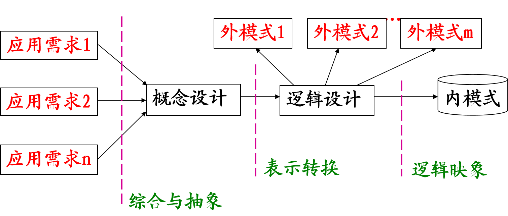

# 十一、数据库设计

[TOC]

## 数据库设计的过程

- (1)需求分析
  - 准确了解与分析用户需求（包括数据与处理）
  - 是整个设计过程的基础，是最困难、最耗时的一步
- (2)概念结构设计
  - 是整个数据库设计的关键
  - 通过对用户需求进行综合、归纳与抽象，形成一个独立于具体DBMS的概念模型
- (3)逻辑结构设计
  - 将概念结构转换为某个DBMS所支持的数据模型
  - 对其进行优化

- (4) 数据库物理设计阶段
  - 为逻辑数据模型选取一个最适合应用环境的物理结构（包括存储结构和存取方法） 
- (5) 数据库实施阶段
  - 运用DBMS提供的数据语言、工具及宿主语言，根据逻辑设计和物理设计的结果
  - 建立数据库、编制与调试应用程序、组织数据入库、并进行试运行
- (6) 数据库运行和维护
  - 数据库应用系统经过试运行后即可投入正式运行。
  - 在数据库系统运行过程中必须不断地对其进行评价、调整与修改。

设计一个完善的数据库应用系统往往是上述六个阶段的不断反复

> 考试喜欢考简答题这里

## 数据库各级模式的形成过程

- 数据库结构设计包括
  - 需求分析阶段： 综合各个用户的应用需求
  - 概念结构设计 ：形成独立于各个DBMS概念模式，如E－R图 
  - 逻辑结构设计 ：形成==数据库逻辑模式==与==外模式==，用(基本)数据模型描述，例基本表、视图等
  - 物理结构设计：形成==数据库内模式==，如DB文件或目录、索引

- 数据库设计分为
  - 结构设计包括设计数据库的==概念结构、逻辑结构和存储结构==
  - 行为设计包括设计数据库的==功能组织==和==流程控制==

## 采用E-R模型方法的概念结构设计

- 设计局部E-R模型
  - E-R模型的设计内容包括确定局部E-R模型的范围、定义实体、联系以及它们的属性。
- 设计全局E-R模型
  - 将所有局部E-R图集成为一个全局E-R图，即全局E-R模型。
- 优化全局E-R模型

## 逻辑结构设计

- 把概念结构设计阶段设计好的基本E-R模型转换为具体的数据库管理系统支持的数据模型，
  - 也就是导出特定的DBMS可以处理的数据库逻辑结构（数据库的模式和外模式），这些模式在功能、性能、完整性和一致性约束方面满足应用要求。
- 逻辑结构设计的步骤
  - 将概念结构转化为特定DBMS支持的数据模型(关系、网状、层次模型)
  - 对数据模型进行优化

## E-R模型向关系模型的转换

- ==一个实体转换为一个关系模式==。实体的属性就是关系的属性，实体的标识符就是关系的码。
- ==对于实体间的联系有以下不同的情况==：
  - 一个==1：1联系==可以转换为一个独立的关系模式，也可以与任意一端所对应的关系模式合并。
  - 一个==1：n联系==可以转换为一个独立的关系模式，也可以与n端所对应的关系模式合并。
  - 一个==m：n联系==转换为一个独立的关系模式。 
  - 三个或三个以上实体间的一个多元联系可以转换为一个关系模式。 
  - 具有相同码的关系模式可以合并。

